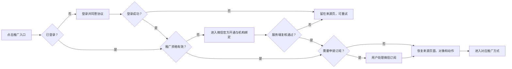
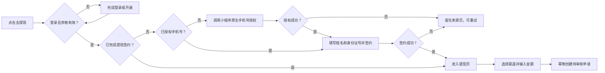

# 黛莱皙私域推客带货平台 PRD 20260723

> 版本：v3.4 0-1 项目本地评审稿  
> 日期：2026-07-23  
> 状态：评审中  
> 成熟度：评审就绪  
> 项目模式：0-1 模式  
> 产品阶段：小程序、运营后台和共享服务均未开发，本文全部功能均为待实现需求  
> 关联平台：微信小程序、Web 运营后台、共享服务  
> 输入来源：合并版 PRD v3.1、低保真交互原型、测试用例、已确认评审结论  
> 写作范围：多客户端、微信能力对接、后台表单与状态流转  

**交互原型**
- [打开微信小程序低保真原型](https://zhangrulei.github.io/dailaixi-promoter-platform/prototype/homepage-lowfi/)
- [打开运营后台低保真原型](https://zhangrulei.github.io/dailaixi-promoter-platform/prototype/admin-lowfi/)
> 原型用于确认页面范围、信息层级、交互和状态，不作为最终视觉规范。原型无法通过 URL 直接定位单个子页面，本文在各功能章节标明对应页面名称。

## 1. 需求背景

### 1.1 业务背景

黛莱皙已有自有微信小店、视频号直播、短视频内容和可触达的私域人群。本项目基于微信小店优选联盟带货机构的推客带货能力，建设品牌自有推客小程序和运营后台，将商品、直播、视频及运营素材分发给私域推客，帮助推客完成分享、自购、订单与收益查询，并由机构完成后续佣金结算和提现管理。

### 1.2 需求来源
from业务

### 1.3 项目价值
通过推客分销促进GMV增长，带动会员活跃。

## 2. 需求目标与收益风险

### 2.1 核心目标
0-1闭环跑通

### 2.2 预期收益
分销GMVxx%

### 2.3 风险与应对

| 0-1 高风险假设/风险 | 可能性 | 影响 | 首版验证与应对 | 决策节点/责任方 |
| --- | --- | --- | --- | --- |
| 微信官方能力可以覆盖推客开通、内容、订单、归因和视频号跳转 | 中 | 高 | 开发排期前完成关键能力技术验证；不以原型代替真实环境结论 | 技术方案与微信联调前 |
| 目标推客愿意完成微信开通并使用品牌小程序推广 | 中 | 高 | 使用低保真进行任务测试；上线前安排小范围试运营 | 产品评审与试运营 |
| 可持续提供有效商品、直播、视频和发圈素材 | 中 | 高 | 上线前准备首批内容并验证同步、授权和失效处理 | 内容运营 |
| 微信订单数据能够支持机构需要的归因和佣金展示 | 中 | 高 | 使用真实订单样本验证字段和状态；信息不足时显示未知 | 技术与订单运营联调 |
| 财税、签约、限额、渠道和到账规则能够在开发前确定 | 高 | 高 | 财务、法务、税务共同确认；未确认前提现模块不得进入开发就绪 | 财务/法务/税务评审 |
| 小程序、后台和共享服务范围过大导致首版延期 | 中 | 高 | 以第 4 章 P0/P1 为范围基线；新增范围必须重新评审优先级 | 需求冻结与排期 |
| 敏感信息、导出或资金操作出现越权和重复处理 | 中 | 高 | 首版纳入权限、脱敏、幂等、审计和安全专项验收 | 开发设计与上线验收 |
| 原型中的交互能够支持真实用户完成核心任务 | 中 | 中 | 对登录开通、商品推广、首次提现和后台内容发布进行可用性验证 | UI 设计前 |

---

## 3. 名词解释

| 名词 | 定义 | 备注 |
| --- | --- | --- |
| 推广大使 | 已完成微信侧推客注册、机构绑定且资格有效的用户侧名称 | 不代表等级 |
| 推广发起 | 成功生成或打开有效官方推广载体 | 不等于已经发送 |
| 自购发起 | 用户以本人推广身份进入购买链路 | 不等于支付或结算 |
| 可提现收益 | 已完成结算并进入机构可支付余额、扣除冻结和调整后的金额 | 待结算收益不可提现 |
| 已提现收益 | 已完成提现且到账成功的金额 | 不含待审核和处理中申请 |
| 直接好友 | 通过本人邀请入口建立的一层有效邀请关系 | 不扩展多级团队 |
| 好友分佣 | 根据直接好友有效结算订单和生效比例生成的本地收益 | 比例可为 0 |
| 规则快照 | 业务发生时保存的佣金、分佣、限额、渠道和税费规则版本 | 历史记录不重算 |
| 支付 GMV | 按支付时间统计的推客归因订单金额 | 与有效、结算 GMV 分开 |
| 有效 GMV | 支付 GMV 扣除统计时点前确认的取消和退款 | 显示统计时点 |
| 结算 GMV | 达到微信结算条件并按结算时间统计的订单金额 | 以微信结果为准 |

---

## 4. 需求范围

### 4.1 范围总览

| 层级 | 客户端/能力 | 使用方 | 主要职责 | 原型 |
| --- | --- | --- | --- | --- |
| 客户端 | 微信小程序 | 游客、推广大使 | 浏览、推广、自购、收益、提现、邀请、帮助 | [打开原型](https://zhangrulei.github.io/dailaixi-promoter-platform/prototype/homepage-lowfi/) |
| 客户端 | Web 运营后台 | 运营、订单、财务、管理员 | 内容、推客、订单、财务、授权、系统和账号管理 | [打开原型](https://zhangrulei.github.io/dailaixi-promoter-platform/prototype/admin-lowfi/) |
| 共享能力 | 服务端与公共数据 | 小程序、后台 | 资格、同步、归因、分佣、提现、权限、日志 | 无独立页面 |
| 外部依赖 | 微信相关能力 | 小程序、服务端 | 推客开通、内容订单、视频号、手机号、订阅和渠道结果 | 微信官方能力 |

### 4.2 功能范围

#### 微信小程序

| 需求 ID | 模块 | 功能范围 | 优先级 | 关联目标 |
| --- | --- | --- | --- | --- |
| FR-MP-001 | 全局能力 | 游客浏览、登录、推广资格、订阅、任务续接 | P0 | G-002/G-005 |
| FR-MP-002 | 首页与搜索 | Banner、快捷频道、热门商品、商品 Feed、混合搜索 | P1 | G-001 |
| FR-MP-003 | 商品 | 详情、SKU、自购、列表分享、详情分享 | P0 | G-001/G-003 |
| FR-MP-004 | 分类 | 一二级分类、搜索、筛选、排序、商品 Feed | P1 | G-001 |
| FR-MP-005 | 直播视频 | 直播列表与详情、视频列表和视频号跳转 | P0 | G-001 |
| FR-MP-006 | 发圈 | 带货发圈、宣发、素材复制下载和商品分享 | P0 | G-001/G-005 |
| FR-MP-007 | 我的与收益 | 收益、佣金、手机号授权、签约、提现和记录 | P0 | G-003/G-005 |
| FR-MP-008 | 关系与服务 | 粉丝、邀请、教程、客服、帮助和设置 | P0 | G-003/G-005 |
| FR-MP-009 | 页面状态 | 加载、空、失败、内容失效和外部跳转失败 | P0 | G-001/G-002 |

#### Web 运营后台

| 需求 ID | 模块 | 功能范围 | 优先级 | 关联目标 |
| --- | --- | --- | --- | --- |
| FR-AD-001 | 公共能力 | 查询、分页、页面状态、权限、版本和日志 | P0 | G-004/G-005 |
| FR-AD-002 | 首页 | 经营指标、趋势和排行 | P1 | G-004 |
| FR-AD-003 | 内容管理 | 商品、直播、视频、发圈、分类、教程和帮助 | P0 | G-001/G-004 |
| FR-AD-004 | 推客管理 | 推客列表、详情、直接粉丝、封禁和解封 | P0 | G-003/G-004 |
| FR-AD-005 | 订单管理 | 订单查询、详情、归因、自购和导出 | P0 | G-003/G-004 |
| FR-AD-006 | 财务管理 | 对账单、提现审核、财务设置、规则快照和导出 | P0 | G-003/G-004 |
| FR-AD-007 | 授权管理 | 微信授权小店同步和只读查询 | P0 | G-004 |
| FR-AD-008 | 系统设置 | 基础设置、页面装修、分享设置、协议与隐私 | P0 | G-001/G-004/G-005 |
| FR-AD-009 | 账户管理 | 后台账号、一级菜单权限和操作日志 | P0 | G-004/G-005 |

#### 共享能力

| 需求 ID | 能力 | 功能范围 | 优先级 | 支持客户端 |
| --- | --- | --- | --- | --- |
| FR-SH-001 | 微信能力衔接 | 资格、商品、订单、归因、视频号、手机号和渠道结果 | P0 | 小程序、后台 |
| FR-SH-002 | 统一业务与数据规则 | 收益、提现、版本、权限、脱敏、导出和审计 | P0 | 小程序、后台 |

#### 不包含

- 自有商城交易、支付、物流和售后系统。
- 脱离微信官方链路后的分享归因承诺。
- 自动群发、自动发布朋友圈、刷量或绕过微信绑定能力。
- 多层级团队、推广等级、培训考试和现金邀请奖励。
- 小程序短视频详情页或自建直播分享面板。
- 最终视觉风格、色值、字号和动效规范。

#### 首版固定约束

- 小程序底部导航为：首页、分类、直播视频、发圈、我的。
- 手机号授权使用小程序原生组件，低保真原型不单独模拟。
- 后台固定八个一级模块，只配置一级菜单权限。
- 商品、直播、视频、订单和归因以微信有效结果为准。
- 协议正文和版本策略由后台配置。

## 5. 流程与状态

### 5.1 推广主流程

完成条件：为当前用户和当前内容生成或打开有效推广载体。登录、开通、订阅和点击按钮本身均不等于推广完成。

### 5.2 提现主流程

完成条件：生成一条提现申请及对应用户端记录。提交成功不等于到账，不直接计入已提现收益。

### 5.3 状态流转

#### 提现状态

| 后台状态 | 用户端状态 | 进入条件 | 资金处理 | 失败/补偿 |
| --- | --- | --- | --- | --- |
| 待审核 | 待处理 | 申请创建成功 | 按最终确认方案冻结或扣减可提现余额 | 创建失败不改变余额 |
| 审核通过/支付处理中 | 处理中 | 审核通过并进入渠道处理 | 不重复扣减；未知税费和到账金额显示“--” | 超时查询最终结果 |
| 到账成功 | 已到账 | 渠道确认到账 | 实际到账金额计入已提现收益 | 不适用 |
| 已驳回 | 已驳回 | 后台驳回并填写原因 | 恢复应退余额并记录一次流水 | 不重复返还 |
| 渠道退回 | 已退回 | 渠道失败或退回 | 恢复应退余额并记录一次流水 | 不重复返还 |

#### 佣金状态

| 当前状态 | 触发条件 | 下一状态 | 系统处理 |
| --- | --- | --- | --- |
| 待结算 | 微信确认结算 | 已结算 | 更新实际佣金和可提现口径 |
| 待结算 | 订单取消、退款或失效 | 已失效 | 记录原因，不进入可提现 |
| 已结算 | 后续调整 | 保持原记录 | 通过独立调整流水表达，不覆盖历史 |

### 5.4 异常流程

| 异常场景 | 系统处理 | 用户反馈 | 恢复方式 |
| --- | --- | --- | --- |
| 单个运营模块加载失败 | 其他模块继续展示 | 当前模块加载失败 | 保留页面并允许重试 |
| 登录或资格失败 | 不执行来源任务 | 说明失败原因 | 留在来源页，可重试或联系客服 |
| 内容操作前失效 | 停止新推广、复制或下载 | 内容不可用 | 返回有效内容列表 |
| 微信跳转失败 | 不提供非官方替代入口 | 检查版本、网络或稍后重试 | 留在当前页面 |
| 金额或税费未知 | 不显示为 0.00 | 显示“--”或“处理中” | 最终结果返回后刷新 |
| 批量审核部分失败 | 成功项生效，失败项保持原状态 | 分项展示结果 | 失败项重新处理 |
| 越权访问 | 页面和接口均拒绝 | 无权限 | 不返回业务数据 |

---

## 6. 功能描述

### 6.1 微信小程序

[打开微信小程序低保真原型](https://zhangrulei.github.io/dailaixi-promoter-platform/prototype/homepage-lowfi/)

#### 6.1.1 FR-MP-001：全局能力

- **优先级**：P0
- **原型定位**：全局流程、登录与推广流程。
- **适用用户**：游客、已登录未开通用户、资格异常用户、推广大使。

| 功能 | 触发条件 | 系统行为 | 特殊规则 |
| --- | --- | --- | --- |
| 启动与游客浏览 | 未登录用户进入小程序 | 允许浏览首页、分类、商品、直播视频、发圈、教程和帮助 | 不在启动时强制登录 |
| 首次登录 | 游客触发分享、自购、收益或邀请等受限操作 | 展示登录面板，成功后返回来源任务 | 登录前必须同意用户协议和隐私政策；头像、昵称选填 |
| 静默登录 | 已注册用户再次进入 | 优先恢复既有会话 | 不读取或覆盖头像、昵称 |
| 推广大使开通 | 用户触发推广能力且资格未开通 | 进入微信官方注册与机构绑定，返回后由服务端复核 | 客户端返回不直接视为开通成功 |
| 订阅通知 | 用户主动触发收益、提现、好友或活动业务 | 调用微信订阅能力并记录结果 | 拒绝、关闭或失败不阻断原任务 |
| 任务续接 | 登录、开通或订阅流程结束 | 恢复来源页面、业务对象和原动作 | 成功后仅执行一次；取消或失败时不误执行 |

- **权限与数据范围**：用户只能访问本人身份和本次任务上下文。
- **业务规则**：`BR-001`、`BR-002`、`BR-003`。

##### 验收标准

| AC ID | Given | When | Then |
| --- | --- | --- | --- |
| AC-FR-MP-001-01 | 游客点击商品“去分享” | 尚未登录 | 展示登录面板并保存当前商品和分享动作 |
| AC-FR-MP-001-02 | 用户完成登录和推广大使开通 | 服务端资格复核通过 | 返回来源页并继续原动作一次 |
| AC-FR-MP-001-03 | 用户拒绝、关闭或订阅失败 | 微信返回结果 | 原任务继续，订阅入口保留 |

计划测试：`MP-G-001～017`。

#### 6.1.2 FR-MP-002：首页与搜索

- **优先级**：P1
- **原型定位**：首页、搜索结果。
- **入口**：底部“首页”及首页搜索框。

| 功能 | 展示字段 | 搜索/筛选 | 操作 | 特殊规则 |
| --- | --- | --- | --- | --- |
| 首页结构 | Logo、搜索、Banner、快捷频道、热门商品、商品 Feed | 商品分类 | 进入搜索、运营内容或商品详情 | 不展示直播、短视频、消息中心和业务分享入口 |
| Banner | 图片、标题、轮播指示 | 不适用 | 跳转后台配置目标 | 未配置目标时不可点击；无有效数据时整个模块隐藏 |
| 快捷频道 | 图标、名称 | 不适用 | 进入配置页面或商品分类 | 仅展示已启用且目标有效的频道 |
| 热门商品 | 商品图、标题、价格、预计收益、分享按钮、推荐理由 | 不适用 | 正文进详情；按钮进分享 | 后台选择并排序；不设置“查看更多” |
| 商品 Feed | 主图、标题、价格、预计收益 | 有效分类 | 进入详情、分页加载 | 卡片不展示活动按钮 |
| 商品搜索 | 商品、直播、短视频结果及各类型数量 | 关键词；全部/商品/直播/短视频 | 进入对应详情或微信承载页 | 搜索商品名称、运营短标题、扩展词、直播标题、视频标题和视频号名称；只返回有效、已授权、已上架内容 |

- **空状态**：无结果时回显关键词，并提供返回热门商品入口。
- **并发规则**：切换关键词或结果类型后，上一请求的迟到结果不得覆盖当前结果。
- **业务规则**：`BR-004`、`BR-005`。

##### 验收标准

| AC ID | Given | When | Then |
| --- | --- | --- | --- |
| AC-FR-MP-002-01 | 后台同时存在有效、停用和失效运营位 | 打开首页 | 仅展示有效配置，空模块不占位 |
| AC-FR-MP-002-02 | 同一关键词命中商品、直播和视频 | 提交搜索 | 按类型返回有效结果并显示数量 |
| AC-FR-MP-002-03 | 用户快速连续提交不同关键词 | 较早请求后返回 | 页面仍展示最后一次查询结果 |

计划测试：`MP-H-001～009、021～022`。

#### 6.1.3 FR-MP-003：商品详情、自购与分享

- **优先级**：P0
- **原型定位**：商品详情、列表分享、详情分享。
- **入口**：首页、分类、搜索结果和带货发圈关联商品。

| 功能 | 展示字段 | 操作 | 特殊规则 |
| --- | --- | --- | --- |
| 商品详情 | 轮播图、商品名称、店铺、SKU、价格、库存、预计收益、佣金提示、推广文案和详情 | 切换 SKU、复制或重新生成文案、自购、分享 | 切换 SKU 后同步更新价格、库存和预计收益；无库存 SKU 不可选 |
| 自购 | 当前商品和所选 SKU | 进入本人购买链路 | 点击只代表发起；订单、自购标识和佣金以微信结果为准 |
| 列表分享 | 分享文案、商品图片、小程序海报、微信码 | 保存图片、复制文案、微信分享 | 分享前校验商品、计划、授权和资格 |
| 详情分享 | 商品海报、购买链接 | 保存海报、复制链接、贴图转发 | 两种分享布局独立，不使用统一通用分享面板 |
| 推广文案 | 已审核商品资料生成的候选文案 | 复制、重新生成 | 不使用未经审核的功效信息，不自动发布 |

- **失效处理**：商品下架、计划失效、授权失效或资格异常后，不再生成或复用旧推广载体。
- **业务规则**：`BR-003`、`BR-004`、`BR-005`、`BR-006`。

##### 验收标准

| AC ID | Given | When | Then |
| --- | --- | --- | --- |
| AC-FR-MP-003-01 | 游客打开有效商品 | 点击商品卡正文 | 直接进入详情，不要求登录 |
| AC-FR-MP-003-02 | 商品已下架 | 从缓存详情发起分享 | 阻止生成新推广载体并提示不可用 |
| AC-FR-MP-003-03 | 用户完成自购并同步订单 | 查看收益 | 自购标识、归因和佣金以微信结果展示，不在点击时预记收益 |

计划测试：`MP-H-010～020`。

#### 6.1.4 FR-MP-004：分类

- **优先级**：P1
- **原型定位**：分类。
- **入口**：底部“分类”。

| 功能 | 展示字段 | 搜索/筛选 | 操作 | 特殊规则 |
| --- | --- | --- | --- | --- |
| 分类导航 | 一级分类名称与图标、当前一级分类下的“全部”和二级分类 | 不适用 | 切换一级或二级分类 | 按后台排序；隐藏或删除分类不展示 |
| 分类商品 | 主图、标题、价格、预计收益 | 当前有效分类 | 进入详情、分页 | 仅展示当前分类内有效商品 |
| 搜索 | 商品名称、搜索扩展词 | 当前分类范围 | 提交、清空 | 不跨分类拼接无关商品 |
| 筛选与排序 | 当前排序状态 | 后台默认、价格升降序、预计收益升降序 | 切换排序 | 每次排序都限制在当前分类 |

- **失效处理**：深链分类失效时回到默认分类，并提示“分类已调整”。
- **业务规则**：`BR-004`、`BR-005`。

##### 验收标准

| AC ID | Given | When | Then |
| --- | --- | --- | --- |
| AC-FR-MP-004-01 | 当前分类存在不同价格和预计收益商品 | 切换排序 | 仅在当前分类范围正确排序 |
| AC-FR-MP-004-02 | 当前分类被后台隐藏或删除 | 通过旧深链进入 | 回到默认分类并提示分类已调整 |

计划测试：`MP-C-001～007`。

#### 6.1.5 FR-MP-005：直播与视频

- **优先级**：P0
- **原型定位**：直播 Feed、直播详情、视频 Feed。
- **入口**：底部“直播视频”。

| 页面 | 展示字段 | 搜索/筛选 | 操作 | 特殊规则 |
| --- | --- | --- | --- | --- |
| 页面结构 | 直播、视频频道和当前选中态 | 当前频道关键词 | 切换频道 | 分别保留滚动位置和筛选条件 |
| 直播列表 | 封面、标题、直播状态、视频号、开播时间、分享文案、预计收益、推广人数 | 直播标题、视频号；直播状态 | 进入详情、去分享 | 状态以微信最新结果为准 |
| 直播详情 | 直播信息、推荐文案、分享话术、直播爆品 | 不适用 | 复制话术、进入直播间 | 使用视频号原生分享，不建设自有直播分享面板 |
| 视频列表 | 封面、播放标识、运营标题、视频号名称、时长 | 视频标题、视频号名称 | 直接进入视频号视频 | 不建设小程序视频详情页和推广按钮；无法核验的播放量不展示 |

- **失效处理**：直播结束、视频下架、删除或授权失效后停止展示和跳转。
- **业务规则**：`BR-004`、`BR-005`、`BR-007`。

##### 验收标准

| AC ID | Given | When | Then |
| --- | --- | --- | --- |
| AC-FR-MP-005-01 | 有效直播且用户资格通过 | 点击进入直播间 | 打开对应视频号直播间 |
| AC-FR-MP-005-02 | 有效视频 | 点击视频卡 | 直接进入对应视频号视频，不出现小程序视频详情页 |
| AC-FR-MP-005-03 | 微信跳转失败 | 用户点击直播或视频 | 留在当前页并提示检查环境或重试 |

计划测试：`MP-L-001～011`。

#### 6.1.6 FR-MP-006：带货发圈与宣发

- **优先级**：P0
- **原型定位**：带货发圈、宣发。
- **入口**：底部“发圈”。

| 页面 | 展示字段 | 搜索/筛选 | 操作 | 特殊规则 |
| --- | --- | --- | --- | --- |
| 页面结构 | 带货发圈、宣发频道和当前选中态 | 当前频道关键词、有效分类 | 切换频道 | 切换频道或筛选条件时重置分页 |
| 带货发圈 | 发布主体、时间、文案、图片、评论话术、绑定商品、价格、预计收益 | 文案、素材标题、商品关键词、分类 | 复制评论、分享绑定商品、下载素材 | 用户不可更换绑定商品 |
| 宣发 | 发布主体、时间、文案、图片或视频 | 文案、素材标题、分类 | 复制文案、下载素材 | 不展示商品、预计收益或商品分享 |
| 素材有效性 | 当前发布版本、有效期和授权状态 | 不适用 | 操作前复核 | 撤回、过期或授权失效后停止复制、下载和分享 |

- **合规约束**：不提供自动群发或自动发布朋友圈。
- **业务规则**：`BR-004`、`BR-007`、`BR-008`。

##### 验收标准

| AC ID | Given | When | Then |
| --- | --- | --- | --- |
| AC-FR-MP-006-01 | 带货发圈已绑定商品 | 点击“分享好物” | 进入该商品分享流程且不可重新选品 |
| AC-FR-MP-006-02 | 用户查看宣发内容 | 执行可用操作 | 仅可复制文案和下载素材，不出现商品分享 |
| AC-FR-MP-006-03 | 素材已撤回或授权失效 | 再次操作 | 阻止复制、下载和分享并提示内容不可用 |

计划测试：`MP-F-001～009`。

#### 6.1.7 FR-MP-007：我的、收益与提现

- **优先级**：P0
- **原型定位**：我的、佣金明细、首次提现签约、提现、提现记录。
- **入口**：底部“我的”。

| 功能 | 展示字段 | 搜索/筛选 | 操作 | 特殊规则 |
| --- | --- | --- | --- | --- |
| 我的首页 | 头像、昵称、当前身份、收益卡及业务入口 | 不适用 | 进入各子页面 | 入口按身份、资格和有效配置展示 |
| 我的收益 | 可提现、累计、已提现、待结算及口径说明 | 不适用 | 隐藏/显示金额、进入提现 | 未登录、未开通或金额未知时显示“--”；待结算不可提现 |
| 佣金明细 | 订单号、商品、来源、支付金额、预计/实际佣金、状态、下单和更新时间 | 订单号、商品；佣金状态、时间 | 查看详情、复制完整订单号 | 页面订单号默认脱敏；用户不可编辑或删除 |
| 首次提现与签约 | 手机号授权状态、姓名、身份证号、签约状态 | 不适用 | 原生手机号授权、填写身份信息、签约 | 已签约用户不重复授权和签约；身份信息仅用于提现签约 |
| 提现申请 | 可提现余额、渠道、金额、单笔/单日限额、税费和到账说明 | 不适用 | 选择渠道、输入金额、提交 | 重复点击或重复请求只能创建一条申请 |
| 提现记录 | 提现单号、申请金额、状态、税费、实际到账金额、方式、申请时间和结果说明 | 状态、申请时间 | 查看详情 | 处理中不展示未确定税费和实际到账金额 |

**提现字段与校验**

| 字段 | 必填 | 输入/来源 | 校验与联动 |
| --- | --- | --- | --- |
| 手机号 | 首次签约必需 | 小程序原生手机号授权 | 未授权不得进入身份签约 |
| 姓名 | 首次签约必填 | 用户输入 | 为空或格式无效时阻止签约；具体校验规则待签约渠道确认 |
| 身份证号 | 首次签约必填 | 用户输入 | 为空或格式无效时阻止签约；页面默认脱敏 |
| 提现渠道 | 必填 | 后台当前已启用渠道 | 至少存在一个可用渠道 |
| 提现金额 | 必填 | 用户输入 | 不低于单笔下限，不高于单笔上限、单日剩余额度或可提现余额 |

- **资金规则**：提交成功只进入“待处理/待审核”；只有到账成功金额计入已提现收益。驳回或渠道退回时恢复应退余额并保留流水。
- **业务规则**：`BR-009`～`BR-014`。

##### 验收标准

| AC ID | Given | When | Then |
| --- | --- | --- | --- |
| AC-FR-MP-007-01 | 未签约且未授权手机号 | 发起首次提现 | 先调用原生手机号授权，未成功前不进入身份签约 |
| AC-FR-MP-007-02 | 金额超出任一有效范围 | 提交提现 | 阻止创建并提示有效范围 |
| AC-FR-MP-007-03 | 同一提交连续点击或重试 | 服务端处理 | 只创建一条申请且资金只处理一次 |
| AC-FR-MP-007-04 | 提现处于处理中 | 查看记录 | 未确定税费和到账金额显示“--/处理中” |
| AC-FR-MP-007-05 | 提现到账成功 | 刷新收益 | 实际到账金额计入已提现收益 |

计划测试：`MP-M-001～024`、`SC-004～007、015`。

#### 6.1.8 FR-MP-008：关系、服务与设置

- **优先级**：P0
- **原型定位**：我的粉丝、邀请好友、推客教程、帮助中心、个人资料与设置。
- **客服与帮助**：包括机构企业微信客服入口和后台发布的帮助中心内容。

| 页面 | 字段/内容 | 搜索/筛选 | 操作 | 特殊规则 |
| --- | --- | --- | --- | --- |
| 我的粉丝 | 直接邀请人数、好友分佣；头像、昵称、推客 ID、手机号、资格、账户、关系时间和分佣 | 昵称、手机号、推客 ID；资格状态 | 查看直接好友、进入邀请 | 只展示一层关系；手机号脱敏；不可编辑、删除 |
| 邀请好友 | 邀请文案、已启用海报、邀请规则 | 不适用 | 分享好友、保存海报、贴图转发 | 不提供现金邀请奖励 |
| 推客教程 | 标题、分类、内容形式、更新时间 | 标题、分类、图文/视频 | 查看详情 | 不记录学习进度、完成状态或考试 |
| 官方客服 | 机构企业微信入口、营业说明 | 不适用 | 联系客服 | 链接由后台配置；不可用时提供重试或其他联系指引 |
| 帮助中心 | 主题、问题和答案 | 关键词、主题 | 查看答案、联系客服 | 仅展示已发布内容 |
| 系统设置 | 头像、昵称、手机号、联系方式、协议 | 不适用 | 修改选填资料、退出、申请注销 | 敏感字段脱敏；退出不等于注销 |

- **关系规则**：已有有效邀请关系不因打开其他邀请链接自动改绑；好友分佣只基于一层直接好友的有效结算订单。
- **注销规则**：执行前说明待处理提现、待结算收益和依法保留财务记录的处理方式。
- **业务规则**：`BR-015`、`BR-016`。

##### 验收标准

| AC ID | Given | When | Then |
| --- | --- | --- | --- |
| AC-FR-MP-008-01 | 新用户通过邀请完成注册绑定 | 服务端建立关系 | 只记录一层直接邀请关系 |
| AC-FR-MP-008-02 | 已存在有效关系 | 打开其他邀请链接 | 不自动改绑 |
| AC-FR-MP-008-03 | 好友分佣比例为 0 | 直接好友产生新结算订单 | 不新增好友分佣，历史记录保留 |
| AC-FR-MP-008-04 | 用户存在待处理提现或待结算收益 | 打开注销说明 | 明确展示影响，确认前不执行注销 |

计划测试：`MP-M-025～034`。

#### 6.1.9 FR-MP-009：页面状态与降级

- **优先级**：P0
- **原型定位**：各页面加载、空状态和异常提示。

| 场景 | 系统行为 | 用户反馈/恢复 |
| --- | --- | --- |
| 页面或模块加载中 | 使用页面级或模块级加载状态，不全屏阻塞其他可用模块 | 等待或继续浏览其他模块 |
| 列表无数据 | 展示明确空状态 | 提供返回或查看其他内容入口 |
| 可选运营模块无数据 | 整个模块隐藏 | 不保留空白框 |
| 内容失效 | 禁止生成新推广载体 | 提示不可用并返回有效内容 |
| 登录或资格失败 | 不执行来源动作 | 说明原因并允许重试或联系客服 |
| 微信跳转失败 | 不提供绕过官方流程的入口 | 检查环境或稍后重试 |
| 金额未知 | 显示“--”或“处理中” | 不显示为 0.00 |

##### 验收标准

| AC ID | Given | When | Then |
| --- | --- | --- | --- |
| AC-FR-MP-009-01 | 单个首页模块接口失败 | 打开首页 | 其他模块继续可用，失败模块可重试 |
| AC-FR-MP-009-02 | 内容在详情停留期间失效 | 用户继续分享 | 阻止操作并引导返回有效内容 |
| AC-FR-MP-009-03 | 金额结果尚未返回 | 展示收益或提现记录 | 显示“--/处理中”，不显示 0.00 |

计划测试：`MP-S-001～007`。

### 6.2 Web 运营后台

[打开运营后台低保真原型](https://zhangrulei.github.io/dailaixi-promoter-platform/prototype/admin-lowfi/)

> 原型导航固定为：首页、内容管理、推客管理、订单管理、财务管理、授权管理、系统设置、账户管理。含多个页面的模块展开二级菜单；只有一个页面的模块点击一级菜单直接进入。

#### 6.2.1 FR-AD-001：后台公共能力

- **优先级**：P0
- **适用用户**：所有后台账号。
- **原型定位**：所有后台列表、弹窗和页面状态。

| 公共能力 | 规则 | 特殊说明 |
| --- | --- | --- |
| 查询与列表状态 | 仅提供各页面明确列出的关键词、状态、类型和时间条件；多个条件组合生效 | 重置后恢复默认条件 |
| 分页 | 列表底部展示总数、页码和每页条数 | 切页不得重复或遗漏数据 |
| 页面状态 | 统一提供加载、空结果和加载失败状态 | 失败时保留筛选条件并允许重试 |
| 推客身份展示 | 推客、收益人、邀请人等统一在同一单元展示头像、昵称和推客 ID | 手机号等其他信息使用独立字段 |
| 权限与访问 | 只配置一级菜单权限；获权后可访问该模块全部子页面 | 未授权模块不显示；URL 和接口同样拒绝 |
| 发布与版本 | 草稿不影响线上；发布后按生效时间应用 | 新版本不覆盖历史版本和既有业务记录 |
| 操作留痕 | 发布、上下架、授权同步、分佣、提现、财务、账号和敏感操作均记录 | 包含对象、操作人、时间、变更前后内容和结果 |
| 弹窗规则 | 详情、新增、编辑和常规配置使用居中操作弹窗；删除、封禁和状态变更使用确认弹窗 | 复杂且需连续操作的业务才进入独立页面 |

- **导出边界**：仅订单列表、用户对账单和提现审核提供导出；其他模块不提供。
- **敏感信息**：手机号、证件号和账户信息按后台统一规则脱敏。
- **业务规则**：`BR-017`、`BR-018`、`BR-019`。

##### 验收标准

| AC ID | Given | When | Then |
| --- | --- | --- | --- |
| AC-FR-AD-001-01 | 账号没有财务管理权限 | 通过菜单、URL 或接口访问 | 均拒绝且不返回业务数据 |
| AC-FR-AD-001-02 | 已发布配置正在使用 | 保存新草稿 | 线上继续使用原版本，发布后才更新 |
| AC-FR-AD-001-03 | 执行财务或账号敏感操作 | 操作完成 | 生成包含变更前后内容的日志 |

计划测试：`AD-C-001～010`。

#### 6.2.2 FR-AD-002：首页经营概览

- **优先级**：P1
- **原型定位**：首页。
- **入口**：后台“首页”。
- **趋势与排行**：与核心指标共用同一时间条件并同步刷新。

| 区域 | 展示内容 | 筛选 | 操作 | 规则 |
| --- | --- | --- | --- | --- |
| 核心指标 | 推客数、订单数、支付 GMV、有效 GMV、结算 GMV、佣金、提现、退款 | 常用时间、自定义起止时间 | 查看 | 支付、有效和结算 GMV 分开统计 |
| 趋势 | 支付 GMV、订单趋势 | 沿用页面时间条件 | 查看 | 与明细汇总一致 |
| 排行 | 内容推广次数排行、支付 GMV 排行 | 沿用页面时间条件 | 查看 | 与业务记录和订单数据一致 |

- **页面规则**：切换时间条件后，指标、趋势和排行同时刷新；不提供数据编辑。

##### 验收标准

| AC ID | Given | When | Then |
| --- | --- | --- | --- |
| AC-FR-AD-002-01 | 已选择同一时间范围 | 对比指标、趋势、排行和明细 | 统计条件一致，三类 GMV 分开 |
| AC-FR-AD-002-02 | 自定义起止时间有效 | 提交筛选 | 所有区域同步刷新 |

计划测试：`AD-D-001～006`。

#### 6.2.3 FR-AD-003：内容管理

- **优先级**：P0
- **原型定位**：内容管理下的商品管理、直播管理、视频管理、发圈与宣发、分类与搜索、教程与帮助。

##### A. 列表与操作

| 页面 | 列表/展示字段 | 搜索/筛选 | 列表操作 | 特殊规则 |
| --- | --- | --- | --- | --- |
| 商品管理 | 商品主图、名称、商品 ID、店铺、一级/二级分类、售价、预估佣金、上架、推荐、推荐文案、更新时间 | 商品名称/ID；店铺、一级/二级分类、上架状态 | 同步、批量设置佣金、批量归类；单行上下架、推荐、调佣、编辑推荐和排序 | 微信同步，不新增或删除；一个商品只归属一个二级分类；下架同步取消推荐 |
| 直播管理 | 直播间、直播状态、上架状态、开播时间、主推商品、推荐文案、分享话术、排序 | 直播间/视频号；直播状态、上架状态 | 同步、上下架、配置主推商品/文案/话术/排序、查看或编辑详情 | 微信同步，不新增或删除；至少一条分享话术才可上架 |
| 视频管理 | 封面、标题、视频号、时长、上架状态、人工排序、最近同步时间 | 视频标题/视频号；上架状态 | 同步、上下架、调整排序 | 微信同步，不新增或删除；只展示可通过官方链路跳转的视频 |
| 发圈与宣发 | 内容与素材、类型、绑定商品、分类、上架状态、排序、更新时间 | 文案、商品、素材 ID；类型、分类、上架状态 | 新增、编辑、上下架、删除、排序 | 带货内容必须绑定一个商品；发布后前端不可换品；宣发不关联商品 |
| 分类与搜索 | 一级分类树、二级分类、排序、显示状态、扩展词 | 通过一级分类树定位 | 一级新增/编辑/显隐/排序；二级新增/编辑/显隐/排序/删除 | 隐藏保留商品关系；删除二级分类清除商品该分类归属 |
| 教程与帮助 | 标题或问题、类型、分类、内容形式、排序、状态、更新时间 | 标题/问题；类型、状态 | 新增、编辑、发布/下架、排序 | 不直接删除；只有已发布内容前端可见 |

##### B. 商品运营配置字段

| 操作 | 字段 | 必填 | 来源/默认 | 校验与生效 |
| --- | --- | --- | --- | --- |
| 设置商品分类 | 一级分类、二级分类 | 是 | 已生效分类 | 二级分类必须属于所选一级分类；单笔或批量更新 |
| 设置商品佣金 | 商品、单品佣金比例 | 是 | 商品只读；比例人工输入 | 比例有效范围待财务确认；单品佣金优先于默认佣金 |
| 首页推荐 | 推荐状态、推荐文案、排序 | 推荐时必填文案 | 默认不推荐 | 商品必须已上架；下架自动取消推荐 |
| 上下架 | 上架状态 | 是 | 当前状态 | 下架后前端停止展示和新推广 |

##### C. 直播和视频配置字段

| 操作 | 字段 | 必填 | 来源/默认 | 校验与生效 |
| --- | --- | --- | --- | --- |
| 直播运营配置 | 主推商品、推荐文案、分享话术、排序 | 上架时至少一条话术 | 商品来自已上架商品；其他人工输入 | 未配置话术不得上架；直播状态仍以微信为准 |
| 视频排序 | 人工排序 | 否 | 未设置时排在已有人工排序之后 | 只影响后台上架视频的前端顺序 |
| 视频上下架 | 上架状态 | 是 | 当前状态 | 下架后前端停止展示和跳转 |

##### D. 发圈与宣发新增/编辑字段

| 字段 | 必填 | 适用类型 | 输入/默认 | 校验与联动 |
| --- | --- | --- | --- | --- |
| 内容类型 | 是 | 全部 | 带货发圈/宣发；默认带货发圈 | 切换类型后同步显示或隐藏商品字段 |
| 发布文案 | 是 | 全部 | 人工输入，最多 500 字（原型约束） | 为空不得保存 |
| 评论话术 | 带货必填 | 带货发圈 | 人工输入 | 小程序“复制评论”使用当前发布版本 |
| 图片素材 | 是 | 全部 | 上传一张或多张图片 | 至少一张；文件大小上限待确认 |
| 绑定商品 | 带货必填 | 带货发圈 | 从已上架商品选择一个 | 宣发类型不展示；发布后前端不可更换 |
| 分类 | 是 | 全部 | 从已生效分类选择 | 用于小程序筛选 |
| 上架状态 | 是 | 全部 | 立即上架/暂不上架；默认暂不上架 | 立即上架前校验全部必填项 |
| 排序 | 否 | 全部 | 新增时追加到末尾 | 支持后续调整 |

> **原型待同步**：后台原型“添加内容”目前未展示“评论话术”和“分类”，与已确认需求不一致；产品需求以上表为准，原型需补齐。

##### E. 分类新增/编辑字段

**一级分类**

| 字段 | 必填 | 输入/默认 | 校验与联动 |
| --- | --- | --- | --- |
| 一级分类名称 | 是 | 人工输入，最多 12 字（原型约束） | 名称不得重复；重命名同步更新分类路径，不丢失商品关系 |
| 分类图标 | 是 | 上传 1:1 图片 | 图片格式和大小上限待确认 |
| 搜索扩展词 | 否 | 多个词以顿号或逗号分隔 | 仅启用且生效后参与小程序搜索 |
| 排序 | 否 | 默认追加到末尾 | 必须为大于等于 1 的整数 |
| 显示状态 | 是 | 默认显示 | 隐藏后一级及其二级入口不展示，商品关系保留 |

**二级分类**

| 字段 | 必填 | 输入/默认 | 校验与联动 |
| --- | --- | --- | --- |
| 所属一级分类 | 是 | 默认当前一级分类 | 只能选择现有一级分类 |
| 二级分类名称 | 是 | 人工输入，最多 12 字（原型约束） | 同一一级分类下不得重复 |
| 排序 | 否 | 默认追加到该一级分类末尾 | 必须为大于等于 1 的整数 |
| 显示状态 | 是 | 默认显示 | 隐藏保留商品关系；删除清除商品该分类归属 |

##### F. 教程与帮助新增/编辑字段

| 字段 | 必填 | 输入/默认 | 校验与联动 |
| --- | --- | --- | --- |
| 内容类型 | 是 | 推客教程/帮助中心；默认推客教程 | 决定标题、内容和内容形式的展示方式 |
| 分类 | 是 | 人工输入或选择 | 用于小程序筛选；分类维护方式待确认 |
| 标题/问题 | 是 | 人工输入，最多 60 字（原型约束） | 教程显示“标题”，帮助显示“问题” |
| 内容形式 | 教程必填 | 图文/视频；默认图文 | 帮助中心固定为问答，不展示该字段 |
| 教程内容/答案 | 是 | 人工输入，最多 2000 字（原型约束） | 教程与帮助使用不同字段标签 |
| 发布状态 | 是 | 默认下架 | 选择“保存后发布”时保存完成即对前端生效 |
| 排序 | 否 | 新增时追加到末尾 | 支持后续调整 |

- **业务规则**：`BR-004`、`BR-005`、`BR-006`、`BR-007`、`BR-008`、`BR-020`。

##### 验收标准

| AC ID | Given | When | Then |
| --- | --- | --- | --- |
| AC-FR-AD-003-01 | 已推荐商品 | 下架商品 | 前端停止展示并同步取消首页推荐 |
| AC-FR-AD-003-02 | 直播没有分享话术 | 尝试上架 | 阻止上架并提示至少配置一条 |
| AC-FR-AD-003-03 | 带货发圈缺少评论话术、图片、分类或商品 | 尝试发布 | 阻止发布并指出缺失字段 |
| AC-FR-AD-003-04 | 宣发内容保存 | 查看新增表单和前端 | 不要求商品，前端不出现商品分享 |
| AC-FR-AD-003-05 | 一级分类重命名 | 保存修改 | 分类路径更新，二级分类和商品关系保留 |
| AC-FR-AD-003-06 | 教程或帮助保存为下架 | 打开小程序 | 前端不可见；发布后才展示 |

计划测试：`AD-CT-001～020`。

#### 6.2.4 FR-AD-004：推客管理

- **优先级**：P0
- **原型定位**：推客管理 / 推客列表。

| 项目 | 需求 |
| --- | --- |
| 列表字段 | 推客（头像、昵称、推客 ID）、手机号、邀请人、资格状态、账户状态、提现签约、直接粉丝数、累计收益、可提现金额、加入时间、操作 |
| 搜索筛选 | 按昵称、手机号、推客 ID 搜索；按开通、注册中、资格异常、已封禁等状态筛选 |
| 列表操作 | 查看推客详情、查看直接粉丝、封禁、解封 |
| 不提供 | 新增、删除、多级团队操作 |
| 特殊规则 | 邀请关系只展示一层；好友收益按已结算佣金统计；本地封禁不修改微信推客资格，解封后重新校验资格 |

**详情字段**

- 基本信息：头像、昵称、推客 ID、手机号、注册和加入时间。
- 状态信息：微信资格、本地账户、提现签约和最近校验时间。
- 关系信息：邀请人、一层直接粉丝数。
- 收益摘要：累计、可提现、待结算和好友分佣。

##### 验收标准

| AC ID | Given | When | Then |
| --- | --- | --- | --- |
| AC-FR-AD-004-01 | 推客被本地封禁 | 发起平台业务 | 本地拒绝，但微信侧资格不被修改 |
| AC-FR-AD-004-02 | 查看某推客直接粉丝 | 打开列表 | 仅展示一层直接关系 |
| AC-FR-AD-004-03 | 解封推客 | 再次进入业务 | 先重新校验微信资格，再决定是否允许操作 |

计划测试：`AD-P-001～006`。

#### 6.2.5 FR-AD-005：订单管理

- **优先级**：P0
- **原型定位**：订单管理 / 订单列表。

| 项目 | 需求 |
| --- | --- |
| 列表字段 | 订单号、商品、推客、推广来源、支付金额、佣金信息、订单状态、自购标识、下单时间、操作 |
| 搜索筛选 | 按订单号、推客、商品搜索；按订单状态、自购标识和下单时间筛选 |
| 列表操作 | 查看详情、按当前筛选导出 |
| 不提供 | 新增、编辑、删除、人工归因 |
| 特殊规则 | 订单状态、商品、支付、自购和归因以微信数据为准；归因不足标记“未知/待确认” |

**订单详情字段**

- 订单：完整订单号、下单时间、支付时间、订单状态、支付金额和退款信息。
- 商品：商品名称、商品 ID、SKU 和来源店铺。
- 推客与来源：推客身份、推广来源、自购标识和归因状态。
- 佣金与结算：预计佣金、实际佣金、佣金状态、结算状态和规则快照版本。

**订单导出规则**

- 导出当前筛选结果，不扩大数据范围。
- 账号必须拥有订单管理一级菜单权限。
- 记录导出人、时间、筛选范围和文件有效期。
- 敏感信息按后台统一规则脱敏。

##### 验收标准

| AC ID | Given | When | Then |
| --- | --- | --- | --- |
| AC-FR-AD-005-01 | 微信未返回完整归因 | 查看订单 | 标记未知/待确认，不人工归因 |
| AC-FR-AD-005-02 | 订单列表已应用筛选 | 执行导出 | 只导出当前筛选和权限范围的数据 |
| AC-FR-AD-005-03 | 退款或失效结果同步 | 查看订单和佣金 | 两者状态按微信结果更新 |

计划测试：`AD-O-001～008`。

#### 6.2.6 FR-AD-006：财务管理

- **优先级**：P0
- **原型定位**：财务管理 / 用户对账单、提现审核、财务设置。

##### A. 用户对账单

| 项目 | 需求 |
| --- | --- |
| 列表字段 | 流水号、用户（头像、昵称、推客 ID）、业务类型、金额、余额变化、关联单号、发生时间 |
| 搜索筛选 | 用户昵称、手机号、流水号；佣金到账/提现；发生时间 |
| 操作 | 查看详情、按当前筛选导出 |
| 不提供 | 新增、编辑、删除或直接修改余额 |
| 特殊规则 | 只有成功资金变动写入对账单并改变余额 |

##### B. 提现审核

| 项目 | 需求 |
| --- | --- |
| 列表字段 | 提现单号、推客、申请金额、扣减税费、打款金额、提现渠道、处理状态、申请时间、操作 |
| 搜索筛选 | 提现单号、推客；待审核、处理中、成功、驳回/退回；申请时间 |
| 操作 | 查看详情、单笔审核、批量通过/驳回、按当前筛选导出 |
| 可选范围 | 只有待审核记录可选择和审核 |
| 特殊规则 | 驳回原因必填；批量逐条返回结果；重复审核不重复处理资金；通过或驳回后不可撤销 |

**审核字段**

| 字段 | 必填 | 输入/来源 | 校验与处理 |
| --- | --- | --- | --- |
| 提现申请信息 | 系统展示 | 申请记录 | 展示推客、金额、渠道、签约和账户脱敏信息，不可编辑 |
| 审核结果 | 是 | 通过/驳回 | 只能处理待审核申请 |
| 驳回原因 | 驳回必填 | 人工输入 | 为空不得提交；用户端展示结果说明 |
| 审核备注 | 否 | 人工输入 | 仅后台和日志可见 |

##### C. 财务设置

| 字段 | 必填 | 输入/默认 | 校验与生效 |
| --- | --- | --- | --- |
| 默认商品佣金比例 | 是 | 人工输入 | 必须在有效范围；单品佣金优先 |
| 好友分佣比例 | 是 | 人工输入，可为 0 | 为 0 时不产生新好友分佣，历史记录保留 |
| 提现渠道 | 至少一个 | 从已接入渠道启停 | 至少启用一个渠道 |
| 单笔最低金额 | 是 | 人工输入 | 不高于单笔最高金额 |
| 单笔最高金额 | 是 | 人工输入 | 不低于单笔最低金额且不高于单日最高金额 |
| 单日最高金额 | 是 | 人工输入 | 不低于单笔最高金额 |
| 到账说明 | 是 | 人工输入 | 小程序提现页展示当前生效版本 |
| 税费梯度 | 是 | 多个区间 | 区间不得重叠或遗漏边界 |

**税费梯度行字段**

| 字段 | 必填 | 规则 |
| --- | --- | --- |
| 月累计提现区间下限 | 是 | 必须大于等于 0 |
| 月累计提现区间上限 | 最后一档可为空 | 必须大于下限；相邻区间边界连续 |
| 税率 | 是 | 有效范围由财务/税务确认 |
| 操作 | 不适用 | 支持新增、编辑和删除；删除后仍需满足区间完整性 |

##### D. 财务导出

- 用户对账单和提现审核分别按当前筛选结果导出。
- 导出内容按账号的财务管理权限控制，敏感账户信息保持脱敏。
- 记录导出人、筛选范围、导出时间和文件有效期。

##### E. 生效与规则快照

- 新配置只影响生效后的订单和提现。
- 订单创建时保存商品、归因、佣金、好友分佣和结算规则版本。
- 提现申请创建时保存限额、渠道和税费规则版本。
- 修改配置不得重算历史订单、已提交申请或既有资金流水。

- **业务规则**：`BR-010`～`BR-014`、`BR-019`。

##### 验收标准

| AC ID | Given | When | Then |
| --- | --- | --- | --- |
| AC-FR-AD-006-01 | 资金操作未成功 | 查询对账单和余额 | 不生成成功流水且余额不变化 |
| AC-FR-AD-006-02 | 同一申请被重复审核 | 重复请求到达 | 状态和资金只处理一次 |
| AC-FR-AD-006-03 | 批量审核包含不可处理记录 | 提交审核 | 每条独立返回结果，失败项不影响成功项 |
| AC-FR-AD-006-04 | 税费区间重叠或存在缺口 | 发布配置 | 阻止发布并指出错误区间 |
| AC-FR-AD-006-05 | 修改佣金、渠道、限额或税费 | 查看新业务和历史记录 | 新业务用新版本，历史记录用原快照 |

计划测试：`AD-FN-001～017`。

#### 6.2.7 FR-AD-007：授权管理

- **优先级**：P0
- **原型定位**：授权管理 / 授权小店列表。

| 项目 | 需求 |
| --- | --- |
| 列表字段 | 小店、小店 ID、主体名称、授权状态、授权时间、到期时间、最近同步时间、操作 |
| 搜索筛选 | 小店名称、小店 ID、主体名称；有效、已过期状态 |
| 操作 | 同步、查看详情 |
| 不提供 | 新增、编辑、删除、发起授权或重新授权 |
| 特殊规则 | 数据和授权状态以微信同步结果为准；过期记录保留并明确标记 |

##### 验收标准

| AC ID | Given | When | Then |
| --- | --- | --- | --- |
| AC-FR-AD-007-01 | 微信存在新增或更新的授权小店 | 执行同步 | 列表状态和有效期与微信一致 |
| AC-FR-AD-007-02 | 账号尝试写入授权记录 | 通过页面或接口操作 | 页面无入口且接口拒绝 |

计划测试：`AD-AU-001～003`。

#### 6.2.8 FR-AD-008：系统设置

- **优先级**：P0
- **原型定位**：系统设置 / 基础设置、页面装修、分享设置、协议与隐私。

##### A. 基础设置

| 字段 | 必填 | 操作 | 生效规则 |
| --- | --- | --- | --- |
| 企业微信客服链接 | 是 | 编辑、校验、保存 | 小程序客服入口使用当前有效链接 |
| 自购开关 | 是 | 开启/关闭 | 控制小程序自购入口展示 |
| 邀请关系开关 | 是 | 开启/关闭 | 仅影响新关系；关闭不得删除既有关系 |

配置变更生成版本和操作日志。商品、直播、视频和素材仍在内容管理维护。

##### B. 页面装修列表

| 对象 | 列表字段 | 操作 | 特殊规则 |
| --- | --- | --- | --- |
| Banner | 标题、图片、跳转目标、状态、排序 | 新增、编辑、启停、删除、上移/下移 | 无跳转目标时仅展示不可点击 |
| 快捷频道 | 图标、名称、跳转路径、状态、排序 | 新增、编辑、启停、删除、上移/下移 | 仅启用且目标有效的频道在首页展示 |

**Banner 新增/编辑字段**

| 字段 | 必填 | 输入/默认 | 校验与联动 |
| --- | --- | --- | --- |
| Banner 图片 | 是 | 上传；建议 750×360px，JPG/PNG | 文件大小上限待确认 |
| Banner 标题 | 是 | 人工输入 | 为空不得保存 |
| 跳转目标 | 否 | 小程序页面或商品目标 | 为空时 Banner 不可点击；填写时目标必须有效 |
| 启用状态 | 是 | 默认启用 | 只有启用项在首页展示 |
| 排序 | 否 | 新增时追加到末尾 | 在列表通过上移/下移调整 |

**快捷频道新增/编辑字段**

| 字段 | 必填 | 输入/默认 | 校验与联动 |
| --- | --- | --- | --- |
| 频道图标 | 是 | 上传；建议 160×160px，JPG/PNG | 文件大小上限待确认 |
| 频道名称 | 是 | 人工输入 | 为空不得保存；长度上限待确认 |
| 跳转路径 | 是 | 小程序内部路径或分类目标 | 保存前校验目标有效性 |
| 启用状态 | 是 | 默认启用 | 只有启用项在首页展示 |
| 排序 | 否 | 新增时追加到末尾 | 在列表通过上移/下移调整 |

##### C. 分享设置

**分享语**

| 字段 | 必填 | 输入/默认 | 校验 |
| --- | --- | --- | --- |
| 默认邀请分享语 | 是 | 人工输入 | 最多 120 字（原型约束） |

**分享海报新增/编辑字段**

| 字段 | 必填 | 输入/默认 | 校验与生效 |
| --- | --- | --- | --- |
| 海报图片 | 是 | 上传；建议 750×1334px，JPG/PNG | 文件大小上限待确认 |
| 海报名称 | 是 | 人工输入，最多 30 字（原型约束） | 仅用于运营识别 |
| 启用状态 | 是 | 默认启用 | 用户只能选择启用海报 |
| 排序 | 否 | 新增时追加到末尾 | 在列表通过上移/下移调整 |

##### D. 协议与隐私

| 项目 | 需求 |
| --- | --- |
| 列表字段 | 协议名称、当前版本、适用场景、状态、生效时间、是否重新确认、操作 |
| 搜索筛选 | 协议名称、版本；草稿、已生效、已停用 |
| 操作 | 查看、新建版本、编辑草稿、发布、停用 |
| 特殊规则 | 协议正文、版本、生效时间和重新确认策略由后台配置；新版本不得覆盖历史同意记录 |

**新建版本/编辑草稿字段**

| 字段 | 必填 | 输入/默认 | 校验与生效 |
| --- | --- | --- | --- |
| 协议名称 | 是 | 人工输入 | 为空不得保存 |
| 版本号 | 是 | 人工输入 | 同一协议版本号不得重复 |
| 适用场景 | 是 | 登录、提现签约或其他受限场景 | 决定用户确认时机 |
| 协议正文 | 是 | 人工输入 | 为空不得保存 |
| 生效时间 | 发布时必填 | 日期时间 | 到达生效时间后使用新版本 |
| 重新确认策略 | 是 | 是/否及适用范围 | 命中策略的用户确认前不得完成对应受限操作 |
| 状态 | 系统生成 | 新建后为草稿 | 只有发布后生效；停用不删除历史记录 |

> **原型待同步**：当前后台原型更接近直接编辑已有协议；产品需求要求“新建版本 → 编辑草稿 → 发布”，原型需改为不可覆盖历史版本的版本化操作。

- **业务规则**：`BR-018`、`BR-020`、`BR-021`。

##### 验收标准

| AC ID | Given | When | Then |
| --- | --- | --- | --- |
| AC-FR-AD-008-01 | 新增 Banner 未上传图片或未填标题 | 保存 | 阻止保存并定位缺失字段 |
| AC-FR-AD-008-02 | Banner 未配置跳转目标 | 用户点击 | 只展示，不发生跳转 |
| AC-FR-AD-008-03 | 新增快捷频道缺少路径 | 保存 | 阻止保存 |
| AC-FR-AD-008-04 | 分享海报已停用 | 用户打开分享页 | 不展示该海报 |
| AC-FR-AD-008-05 | 发布协议新版本并要求重新确认 | 用户命中适用场景 | 确认前不能完成对应受限操作，历史同意记录保留 |

计划测试：`AD-SY-001～009`、`SC-001～002`。

#### 6.2.9 FR-AD-009：账户管理

- **优先级**：P0
- **原型定位**：账户管理 / 后台账号、操作日志。

##### A. 后台账号

| 项目 | 需求 |
| --- | --- |
| 列表字段 | 账号名称、手机号、一级菜单权限、状态、最近登录时间、操作 |
| 搜索筛选 | 账号名称、手机号；正常、已封禁 |
| 操作 | 新增、编辑、封禁、解封、删除 |
| 特殊规则 | 每个账号至少选择一个一级菜单；不配置角色、二级菜单或独立操作权限 |

**新增/编辑字段**

| 字段 | 必填 | 输入/默认 | 校验与生效 |
| --- | --- | --- | --- |
| 账户名称 | 是 | 人工输入 | 不得重复；为空不得保存 |
| 手机号 | 是 | 人工输入 | 手机号格式待确认；列表默认脱敏 |
| 一级菜单权限 | 是 | 多选八个一级模块 | 至少选择一个；选择后可访问该模块全部子页面 |
| 状态 | 编辑时展示 | 新增默认正常 | 封禁后登录和旧会话均不可继续访问 |
| 初始登录方式 | 待决策 | 短信、企业身份或其他方式 | 原型未定义，开发前确认 |

##### B. 操作日志

| 项目 | 需求 |
| --- | --- |
| 列表字段 | 时间、操作人、事件类型、操作内容、处理结果 |
| 搜索筛选 | 操作人、操作内容；事件类型、时间 |
| 操作 | 查看详情 |
| 不提供 | 新增、编辑、删除、导出 |
| 特殊规则 | 账号删除后，历史日志继续按原操作人标识查询 |

- **业务规则**：`BR-017`、`BR-019`。

##### 验收标准

| AC ID | Given | When | Then |
| --- | --- | --- | --- |
| AC-FR-AD-009-01 | 新增账号未选择菜单 | 保存 | 阻止保存并提示至少选择一个一级菜单 |
| AC-FR-AD-009-02 | 账户名称已存在 | 新增或编辑保存 | 阻止保存并提示名称重复 |
| AC-FR-AD-009-03 | 账号被封禁或删除 | 登录或继续使用旧会话 | 均拒绝访问 |
| AC-FR-AD-009-04 | 已删除账号存在历史操作 | 查询日志 | 历史日志仍可查看 |

计划测试：`AD-AC-001～008`。

### 6.3 共享能力与全局约束

#### 6.3.1 FR-SH-001：微信能力衔接

- **优先级**：P0
- **用途**：统一处理推客资格、商品订单、视频号、手机号授权、订阅和渠道结果。

| 依赖能力 | 责任方 | 产品约束 | 异常与补偿 | 状态 |
| --- | --- | --- | --- | --- |
| 推客开通与资格 | 微信/机构服务 | 从微信返回后由服务端复核 | 失败留在来源页，不执行原任务 | 已确认 |
| 商品、订单和归因 | 微信小店/机构服务 | 微信为事实来源，本地记录同步时间 | 迟到结果允许修订，归因不足标记待确认 | 已确认 |
| 直播和视频号 | 微信/小程序 | 使用官方跳转和原生分享 | 跳转失败留在当前页 | 已确认 |
| 手机号授权 | 微信小程序 | 仅首次提现未授权时调用原生组件 | 拒绝或失败不进入身份签约，可重试 | 已确认 |
| 订阅消息 | 微信小程序 | 仅在用户主动触发相关业务时申请 | 任何订阅结果不阻断原任务 | 已确认 |
| 提现支付 | 机构服务/支付渠道 | 使用唯一业务单号，按渠道最终结果更新 | 超时查询、失败补偿余额且不得重复 | 待渠道确认 |

##### 验收标准

| AC ID | Given | When | Then |
| --- | --- | --- | --- |
| AC-FR-SH-001-01 | 微信开通流程返回小程序 | 服务端尚未确认资格 | 不生成推广载体 |
| AC-FR-SH-001-02 | 支付或提现回调重复到达 | 服务端处理 | 状态和资金流水只更新一次 |
| AC-FR-SH-001-03 | 微信归因信息不足 | 同步订单 | 标记未知/待确认，不生成虚构归因 |

#### 6.3.2 FR-SH-002：统一业务、数据、安全和审计

- **优先级**：P0

##### A. 业务规则

| ID | 规则 |
| --- | --- |
| BR-001 | 游客可浏览公开内容；登录只在受限操作发生时触发。 |
| BR-002 | 门禁保存来源页面、对象和动作；成功后续接一次，失败不执行。 |
| BR-003 | 客户端返回、按钮点击或跳转发起不直接代表资格、分享、支付、结算或提现成功。 |
| BR-004 | 新推广、复制或下载动作前校验内容状态、推广计划、授权和用户资格。 |
| BR-005 | 商品、直播、视频、订单、自购、归因和佣金以微信有效结果为准。 |
| BR-006 | 单品佣金优先于默认佣金；历史订单使用业务发生时的规则快照。 |
| BR-007 | 直播、视频和素材仅使用当前有效发布版本；失效后停止新操作。 |
| BR-008 | 禁止自动群发、自动发布朋友圈、刷量和绕过微信绑定。 |
| BR-009 | 提现前必须登录、资格有效、存在可提现收益、完成手机号授权和提现签约。 |
| BR-010 | 提现金额同时受单笔下限、单笔上限、单日剩余额度和可提现余额约束。 |
| BR-011 | 提现创建、审核、支付回调和余额补偿均保持幂等。 |
| BR-012 | 提交提现只进入待处理；只有到账成功金额计入已提现收益。 |
| BR-013 | 驳回或渠道退回时恢复应退余额并生成一次流水，不得重复返还。 |
| BR-014 | 对账单只记录成功资金变动；页面和接口不得直接修改用户余额。 |
| BR-015 | 邀请只建立一层直接关系；已有有效关系不自动改绑。 |
| BR-016 | 敏感信息按用途最小化采集，页面、日志和导出按规则脱敏。 |
| BR-017 | 后台按一级菜单鉴权；页面、URL 和接口使用同一权限结果。 |
| BR-018 | 影响线上展示、资金和存量关系的配置保留草稿、生效和历史版本。 |
| BR-019 | 导出仅限订单、对账单和提现审核，按筛选和权限生成并留痕。 |
| BR-020 | 内容发布前确认来源、版权、肖像和功效表述；AI 只生成候选文案。 |
| BR-021 | 协议正文、版本和重新确认策略由后台配置；新版本不覆盖历史同意记录。 |

##### B. 核心数据

| 实体 | 事实来源 | 关键内容 | 权限与生命周期 |
| --- | --- | --- | --- |
| 用户/推客 | 本地记录 + 微信资格 | 身份、授权、资格、账户、签约 | 本人或授权后台；敏感字段脱敏 |
| 内容 | 微信同步 + 本地运营配置 | 微信状态、上架、分类、排序、推荐、版本 | 失效后停止新推广 |
| 订单/佣金 | 微信结果 + 本地分佣 | 订单、归因、自购、预计/实际佣金、状态 | 只读；保留规则快照 |
| 提现/流水 | 本地申请 + 渠道结果 | 金额、税费、渠道、状态、余额变化 | 不删除；幂等；可审计 |
| 配置/协议 | 本地版本记录 | 草稿、发布、生效、停用、历史版本 | 新版本不覆盖历史 |
| 操作日志 | 本地系统记录 | 对象、操作人、时间、变化、结果 | 只读；账号删除后保留 |

##### C. 非功能需求

| ID | 类别 | 可验证要求 | 优先级 | 验证方式 |
| --- | --- | --- | --- | --- |
| NFR-001 | 可用性 | 单个非核心模块失败不阻断其他公开模块，并提供重试 | P1 | 故障注入 |
| NFR-002 | 幂等 | 提现提交、审核、支付回调和余额补偿不重复执行 | P0 | 重复与并发测试 |
| NFR-003 | 权限 | 无一级菜单权限时页面、URL 和接口均拒绝且不返回业务数据 | P0 | 权限矩阵 |
| NFR-004 | 隐私 | 敏感信息不进入 URL 和普通日志，存储按要求加密或不可逆处理 | P0 | 抓包、日志和存储检查 |
| NFR-005 | 导出 | 导出按筛选和权限生成，过期后不可访问并保留日志 | P0 | 导出专项 |
| NFR-006 | 兼容 | 微信开通、手机号授权、订阅、视频号跳转和支付在真实环境验证 | P0 | 真机端到端 |
| NFR-007 | 审计 | 影响线上、资金、权限和敏感数据的操作均可追溯到人和结果 | P0 | 日志抽查 |

##### D. 跨端一致性与差异

| 能力 | 小程序 | 运营后台 | 共享约束 |
| --- | --- | --- | --- |
| 推客状态 | 展示本人状态和引导 | 查询、封禁、解封 | 微信资格与本地账户状态分离 |
| 内容状态 | 只展示有效内容 | 同步并配置上架、分类和版本 | 操作前复核当前有效版本 |
| 订单归因 | 展示本人佣金结果 | 查看订单和归因 | 微信结果为准，未知不强行归因 |
| 提现状态 | 待处理、处理中、已到账、驳回/退回 | 待审核、支付处理和最终结果 | 同一申请、状态映射和资金流水 |
| 协议 | 用户查看和确认 | 配置版本和策略 | 历史同意记录不覆盖 |

##### 验收标准

| AC ID | Given | When | Then |
| --- | --- | --- | --- |
| AC-FR-SH-002-01 | 账号没有对应一级菜单权限 | 直接调用模块接口 | 请求被拒绝且无业务数据 |
| AC-FR-SH-002-02 | 修改佣金或提现配置 | 查看修改前业务 | 历史记录继续使用创建时规则版本 |
| AC-FR-SH-002-03 | 检查页面、接口、日志和导出 | 涉及手机号、身份证号或账户 | 均按用途和权限处理，不出现不必要完整值 |
| AC-FR-SH-002-04 | 导出文件超过有效期 | 再次访问 | 文件不可访问，导出记录仍保留 |

计划测试：`AD-C-004～009`、`SC-001～015`。

---

## 7. 数据埋点需求

### 7.1 埋点原则

仅记录能够回答经营问题或定位关键失败的数据。订单、佣金和提现优先使用服务端业务记录与微信回调；前端只补充必要入口和失败上下文。

不采集无明确用途的滚动、停留和普通组件点击，不在事件参数中记录身份证号、完整手机号或账户完整值。

### 7.2 必要事件

| 事件 | 触发条件 | 必要维度 | 对应目标 | 数据来源 |
| --- | --- | --- | --- | --- |
| 登录结果 | 登录完成、取消或失败 | 来源任务、结果类型 | G-002 | 前端结果 + 服务端会话 |
| 推客资格校验结果 | 发起受限推广动作 | 内容类型、来源、资格结果 | G-001/G-002 | 服务端资格记录 |
| 推广发起结果 | 生成或打开有效推广载体 | 内容 ID、类型、来源、结果 | G-001 | 服务端业务记录 |
| 关键外部跳转失败 | 视频号或微信能力跳转失败 | 能力类型、失败类型 | G-001 | 前端失败上下文 |
| 提现申请结果 | 申请创建成功或失败 | 申请 ID、渠道、金额区间、失败类型 | G-003 | 服务端申请记录 |
| 提现最终结果 | 到账、驳回或退回 | 申请 ID、最终状态 | G-003 | 渠道结果 + 资金流水 |

### 7.3 统计指标

| 指标 | 口径 | 时间/单位 | 展示位置 | 目标值 |
| --- | --- | --- | --- | --- |
| 推客数 | 按后台当前统计定义计算 | 选择范围/人 | 后台首页 | 待运营确认 |
| 支付 GMV | 按支付时间统计推客归因订单金额 | 选择范围/元 | 后台首页 | 待运营确认 |
| 有效 GMV | 支付 GMV 扣除统计时点前确认的取消和退款 | 选择范围/元 | 后台首页 | 待运营确认 |
| 结算 GMV | 达到微信结算条件的订单金额 | 结算时间/元 | 后台首页 | 待运营确认 |
| 内容推广次数 | 成功生成或打开有效推广载体的次数 | 选择范围/次 | 后台排行 | 待运营确认 |
| 提现结果 | 按申请、处理中、到账、驳回/退回统计 | 笔/元 | 首页、财务管理 | 待运营确认 |

---

## 附录

### A. 假设与待决策

| ID | 类型 | 内容 | 影响 | 阻塞级别 | 决策节点 |
| --- | --- | --- | --- | --- | --- |
| A-001 | 假设 | 低保真原型表达待实现的目标范围和交互，不代表现有产品，不约束最终视觉 | UI 仍需单独设计评审 | 非阻塞 | UI 设计前 |
| A-002 | 假设 | 微信能够返回所需资格、内容、订单、归因和渠道结果 | 核心业务依赖真实环境验证 | 阻塞 | 联调前 |
| O-001 | 待决策 | 签约主体、收入性质、税费、代扣代缴、开票和支付渠道 | 提现规则、文案、字段和验收无法开发就绪 | 阻塞 | 财务/法务/税务评审 |
| O-002 | 待决策 | 提交提现后冻结余额还是直接扣减并在失败时返还 | 影响余额字段、流水时点、并发和对账 | 阻塞 | 财务和技术方案评审 |
| O-003 | 待决策 | 后台账号初始登录和身份验证方式 | 新增账号流程无法开发就绪 | 阻塞 | 账户方案评审 |
| O-004 | 待决策 | 上传图片的文件大小、压缩、裁剪和失败重试规则 | 页面装修、海报、分类和发圈上传验收不完整 | 非阻塞 | UI/技术方案评审 |
| O-005 | 待决策 | 教程与帮助分类采用自由输入还是独立分类配置 | 影响后台字段和筛选一致性 | 非阻塞 | 内容运营评审 |
| O-006 | 待决策 | 注销后用户、关系、订单、财务和日志的具体保留期限 | 注销说明和数据处理无法定稿 | 阻塞 | 隐私合规评审 |

### B. 原型一致性检查

| 检查项 | 结果 | 处理 |
| --- | --- | --- |
| 小程序信息架构和核心入口 | 一致 | 文档按原型页面名称关联 |
| 手机号授权 | 一致 | 使用原生组件，原型无需模拟系统授权界面 |
| 后台八个一级模块 | 一致 | 文档沿用相同模块边界 |
| 发圈新增字段 | 不一致 | 原型缺少评论话术和分类；以 PRD 为准补原型 |
| 协议版本操作 | 不一致 | 原型偏直接编辑；改为新建版本、编辑草稿和发布 |
| 单页原型深链 | 不支持 | 文档使用整套原型链接并标注页面定位 |

### C. 评审结果

| 检查领域 | 结果 | 说明 |
| --- | --- | --- |
| 背景与目标 | 通过 | 已按 0-1 项目重写建设动因、首版验证目标和高风险假设，未虚构经营指标 |
| 范围与用户 | 通过 | 已按 0-1 项目定义小程序、后台、共享能力和用户角色；全部能力待建设 |
| 流程与状态 | 待决策 | 主流程已闭环；余额处理口径见 O-002 |
| 功能与验收 | 通过 | 新增、编辑和配置操作已补充字段、校验和验收 |
| 原型一致性 | 待修正 | 发圈字段和协议版本操作需同步原型 |
| 数据与接口 | 待决策 | 账号登录、上传规则和外部支付规则尚未确认 |
| 非功能与合规 | 待决策 | 财税和注销期限尚未确认 |

### D. 相关文档

- 原始合并版 PRD（仅作为本地历史资料，不在 GitHub 发布）
- [测试用例](./黛莱皙推客带货平台_测试用例.md)
- [微信小程序低保真原型](https://zhangrulei.github.io/dailaixi-promoter-platform/prototype/homepage-lowfi/)
- [运营后台低保真原型](https://zhangrulei.github.io/dailaixi-promoter-platform/prototype/admin-lowfi/)
- [微信小店优选联盟推客带货指南](https://store.weixin.qq.com/chengzhang/article/wiki?docid=7129&nonce=eaecf8415ca86666&category_key=growth_center_manual_for_promoter)
- [推客带货 API 文档](https://developers.weixin.qq.com/doc/store/leagueheadsupplier/api/)

### E. 变更记录

| 版本 | 日期 | 变更内容 | 作者 |
| --- | --- | --- | --- |
| v3.4 0-1 项目本地评审稿 | 2026-07-23 | 重写第一、第二章：明确从零建设背景、首版闭环目标、利益相关方价值和 0-1 高风险验证 | Codex |
| v3.3 0-1 项目本地评审稿 | 2026-07-23 | 将项目模式纠正为 0-1；明确所有需求均未开发；删除迭代专属的现状、迁移和保持不变表述 | Codex |
| v3.2 本地评审稿 | 2026-07-23 | 按 PRD Writing 模板重写；补齐新增、编辑和配置字段；关联原型并记录原型差异 | Codex |
