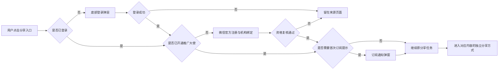
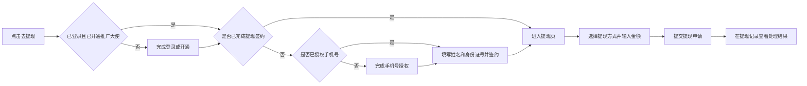

# 黛莱皙私域推客带货平台 产品总纲与 PRD


| 项目    | 内容                                                        |
| ----- | --------------------------------------------------------- |
| 文档版本  | v3.1                                                      |
| 更新日期  | 2026-07-22                                                |
| 产品形态  | 微信小程序 + Web 运营后台                                          |
| 文档状态  | 待评审                                                       |
| 小程序原型 | [打开小程序低保真交互原型](https://zhangrulei.github.io/dailaixi-promoter-platform/prototype/homepage-lowfi/) |
| 后台原型  | [打开运营后台低保真交互原型](https://zhangrulei.github.io/dailaixi-promoter-platform/prototype/admin-lowfi/)   |
| 历史版本  | [v2.12 详细历史版](./archive/黛莱皙推客带货平台_PRD_v2.12_历史版.md)       |


## 一、产品总纲


### 1. 项目背景

黛莱皙已有自有微信小店、视频号直播、短视频内容和可触达的私域人群。本项目基于微信小店优选联盟带货机构的推客带货能力，建设品牌自有推客小程序和运营后台，将商品、直播、视频及运营素材分发给私域推客，帮助推客完成分享、自购、订单与收益查询，并由机构完成后续佣金结算和提现管理。

### 2. 产品目标

建立黛莱皙商品、直播、视频和素材的统一私域分发入口，发展推客并带动可归因GMV增长。

### 3. 用户与业务状态


| 状态         | 可用能力                                 |
| ---------- | ------------------------------------ |
| 游客         | 浏览公开首页、分类、商品、直播视频、发圈、教程和帮助内容         |
| 已登录未开通推广大使 | 保留浏览能力；触发分享或收益相关能力时进入推广大使开通流程        |
| 已开通推广大使    | 分享商品、直播及发圈内容，发起自购，查看订单、收益、粉丝和邀请页面    |
| 已开通未完成提现签约 | 可正常推广和查看收益；首次提现时，未授权手机号先完成授权，再补充姓名和身份证号并签约 |
| 资格异常或已解绑   | 可查看允许保留的历史信息；暂停生成新的推广载体，并提示重新校验或联系客服 |


### 5. 术语定义


| 名称     | 定义                                    |
| ------ | ------------------------------------- |
| 推广大使   | 已完成微信侧推客注册、机构绑定且资格有效的用户侧展示名称，不代表等级    |
| 推广发起   | 成功生成或打开可用于分享的官方推广载体，不等于已实际发送          |
| 自购发起   | 用户通过本人推广身份进入购买链路，不等于已支付或已结算           |
| 我的收益   | 已提现收益、可提现收益和待结算收益的合计口径；未登录或未开通时显示“--” |
| 可提现收益  | 已完成结算并进入机构可支付余额、扣除冻结和调整后的金额           |
| 待结算收益  | 已产生但尚未完成结算、暂不可提现的佣金                   |
| 直接好友   | 通过本人邀请入口建立的一层有效邀请关系                   |
| 好友分佣   | 机构按后台生效比例，根据直接好友有效结算订单生成给邀请人的本地收益     |
| 支付 GMV | 按支付时间统计的推客归因订单金额                      |
| 有效 GMV | 支付 GMV 扣除截至更新时间已确认的取消和退款金额            |
| 结算 GMV | 达到微信结算条件并按结算时间统计的订单金额                 |


---


## 二、产品信息架构与核心流程


### 1. 小程序信息架构

```text
小程序
├─ 首页
│  ├─ Banner / 快捷频道 / 热门商品 / 商品 Feed
│  ├─ 商品详情
│  ├─ 列表分享
│  └─ 详情分享
├─ 分类
│  └─ 一级分类 / 二级分类 / 排序 / 商品 Feed
├─ 直播视频
│  ├─ 直播 Feed / 直播详情
│  └─ 视频 Feed
├─ 发圈
│  ├─ 带货发圈 Feed
│  └─ 宣发 Feed
├─ 我的
│  ├─ 个人信息与设置
│  ├─ 我的收益 / 佣金明细 / 手机号授权 / 首次提现签约 / 提现 / 提现记录
│  ├─ 我的粉丝 / 邀请好友 / 好友收到邀请
│  └─ 推客教程 / 官方客服 / 帮助中心
└─ 全局流程
   ├─ 首次登录 / 后续静默登录
   ├─ 推广大使开通
   └─ 订阅通知
```

底部导航固定为：首页、分类、直播视频、发圈、我的。

### 2. 运营后台信息架构

```text
运营后台
├─ 首页
│  └─ 经营概览
├─ 内容管理
│  ├─ 商品管理
│  ├─ 直播管理
│  ├─ 视频管理
│  ├─ 发圈与宣发素材
│  └─ 分类、搜索、教程与帮助内容
├─ 推客管理
│  └─ 推客列表（含详情、资格状态与直接粉丝）
├─ 订单管理
│  └─ 订单列表（含佣金、自购与归因信息）
├─ 财务管理
│  ├─ 用户对账单
│  ├─ 提现审核
│  └─ 财务设置
├─ 授权管理
│  └─ 授权小店列表（含已过期）
├─ 系统设置
│  ├─ 基础设置
│  ├─ 页面装修
│  ├─ 分享设置
│  └─ 协议与隐私
└─ 账户管理
   ├─ 后台账号
   └─ 操作日志
```


### 3. 分享主流程




### 4. 提现主流程




---


## 三、小程序 PRD


### 1. 全局能力


| 需求名称      | 需求描述                                                                               | 交互/原型              | 备注                   |
| --------- | ---------------------------------------------------------------------------------- | ------------------ | -------------------- |
| 启动与游客浏览   | 启动时读取页面配置、会话和用户资格。游客可浏览公开内容；单个模块失败不阻塞其他公开页面。游客态不展示虚假推客 ID 或模拟收益。                   | 原型目录：全局流程、我的       | 收益未知时显示“--”，不显示 0.00 |
| 首次登录      | 用户首次触发需要身份的操作时，从底部弹出登录面板。用户需勾选《用户协议》和《隐私政策》后登录；头像和昵称允许在该面板选填，不作为登录前置条件。登录成功后继续原操作。 | 原型目录：全局流程 / 登录     | 未设置资料时使用平台默认头像和昵称    |
| 后续静默登录    | 已建立账号后，小程序启动或会话续期优先静默恢复身份，不重复展示首次资料设置。静默流程不得自动读取或覆盖头像、昵称；失败后在用户再次触发受限操作时展示登录面板。    | 原型目录：全局流程 / 登录     | 静默登录仅恢复账号和会话         |
| 推广大使开通    | 未完成推客注册或机构绑定的用户，在分享、查看收益等需要推客身份的场景进入微信官方流程；从官方页面返回后重新查询资格，成功后自动续接来源任务。             | 原型目录：全局流程 / 推广大使开通 | 提现签约不作为推广门禁          |
| 订阅通知      | 用户首次开通推广大使后发起分享时可展示一次订阅弹窗，也可从“我的”主动发起。允许、拒绝、关闭或失败均继续原分享；只有微信明确返回允许后，隐藏“订阅通知小助手”入口。 | 原型目录：全局流程 / 订阅通知   | 覆盖收益、提现、好友、活动通知      |
| 全局返回与任务续接 | 登录、开通、订阅等流程需保存来源页面和来源任务；成功后返回来源并继续，取消或失败时留在来源页面。底部导航从详情页可直接切回对应一级页面。               | 见完整交互原型            | 避免用户重复查找原入口          |


### 2. 首页与商品推广

[查看完整原型：首页、商品详情、列表分享、详情分享](https://zhangrulei.github.io/dailaixi-promoter-platform/prototype/homepage-lowfi/)


| 需求名称         | 需求描述                                                                                                  | 交互/原型                   | 备注                |
| ------------ | ----------------------------------------------------------------------------------------------------- | ----------------------- | ----------------- |
| 首页整体布局       | 顶部单行展示 Logo、搜索框和微信原生胶囊，搜索框位于 Logo 与胶囊之间；下方依次为非通栏 Banner、快捷商品频道、热门商品和商品 Feed。首页不展示直播、短视频、消息中心或业务分享按钮。  | 原型目录：首页                 | Banner 与内容区左右边距对齐 |
| Banner 与快捷频道 | Banner 支持后台配置图片、标题、跳转目标、排序和启停状态，不配置跳转目标时点击不跳转。快捷频道用于新品、护肤、彩妆、套装等运营入口，由后台配置频道图标、名称、排序和启停状态。            | 原型目录：首页 / Banner、快捷商品频道 | 后台无有效内容时隐藏相应入口    |
| 热门商品         | 热门商品由后台人工选择和排序，采用纵向列表连续展示，不设置“查看更多”。每张卡展示商品图、标题、价格、突出显示的“赚 ¥xx”、去分享按钮及底部推荐理由。                         | 原型目录：首页 / 热门商品          | 去分享按钮文案固定为“去分享”   |
| 商品 Feed      | 热门商品后展示分类商品 Feed。卡片仅保留主图、商品标题、价格和“赚 ¥xx”，与分类页商品卡保持一致；不展示“抢”等活动按钮。                                     | 原型目录：首页 / 商品 Feed       | 价格弱化，收益信息优先级更高    |
| 商品卡点击区       | 点击商品卡正文进入商品详情；点击“去分享”执行登录、推广大使开通及订阅判断，满足条件后进入列表分享。两个热区互不替代。                                           | 原型右侧关键交互说明              | 普通浏览商品详情不要求登录     |
| 商品详情         | 顶部为微信小程序导航和横向商品图片轮播；主体展示价格、赚取金额、商品名称、店铺、佣金提示、销售主体声明、推广文案和商品详情。推广文案可基于已审核商品信息生成，用户可复制或重新生成。            | 原型目录：首页 / 商品详情          | 生成依据仅使用已审核商品资料    |
| 商品分享         | 列表分享提供分享文案及图片、分享小程序海报、分享微信码、分享小程序；详情分享展示带当前推客归因能力的商品海报和购买链接，并提供分享海报、保存海报、复制链接、转发为贴图。两种布局独立，不设置通用分享面板。 | 原型目录：首页 / 列表分享、详情分享     | 分享前实时校验商品及推客资格    |
| 自购           | 商品详情底部提供“自购”和“分享赚”两个独立入口。自购进入本人购买链路；分享赚进入分享流程。订单是否属于自购及是否产生佣金，以微信可核验数据为准。                             | 原型目录：首页 / 商品详情          | 自购不等于必然获得佣金       |
| 商品搜索         | 首页搜索商品、直播和短视频，提交后进入分组结果；无结果时展示空态，不混入失效内容。                                                             | 原型首页顶部                  | MVP 可保留最近搜索词      |


### 3. 分类

[查看完整原型：分类](https://zhangrulei.github.io/dailaixi-promoter-platform/prototype/homepage-lowfi/)


| 需求名称  | 需求描述                                                                     | 交互/原型   | 备注               |
| ----- | ------------------------------------------------------------------------ | ------- | ---------------- |
| 分类页布局 | 顶部保留商品搜索和微信原生胶囊；下方横向展示一级分类及“全部”入口，左侧展示当前一级下的二级分类，右侧展示默认、佣金、价格排序和商品 Feed。 | 原型目录：分类 | 一、二级分类均支持后台排序与启停 |
| 分类商品  | 商品卡信息和首页商品 Feed 保持一致：主图、标题、价格、“赚 ¥xx”。点击卡片进入商品详情，分享从详情或卡片对应入口发起。         | 原型目录：分类 | 不展示“抢”按钮         |
| 筛选与排序 | 支持一级 / 二级分类切换、默认排序、佣金升降序和价格升降序。分类或筛选无结果时展示空态，并可回到全部商品。                   | 见完整交互原型 | 排序基于当前有效商品数据     |


### 4. 直播视频

[查看完整原型：直播 Feed、直播详情、视频 Feed](https://zhangrulei.github.io/dailaixi-promoter-platform/prototype/homepage-lowfi/)


| 需求名称        | 需求描述                                                                                      | 交互/原型                    | 备注                    |
| ----------- | ----------------------------------------------------------------------------------------- | ------------------------ | --------------------- |
| 页面框架        | 顶部使用“直播 / 视频”Tab 切换两个独立 Feed，并提供频道内搜索。两个 Tab 均展示全部有效内容，不设置“查看更多”。                         | 原型目录：直播视频                | 首页不重复展示直播和视频          |
| 直播 Feed 与详情 | 直播卡展示封面、直播状态、账号、灰色推荐文案、赚取金额、推广人数和“去分享”。点击卡片进入直播详情，详情展示直播信息、可复制分享话术、直播爆品、分享流程和固定“进入直播间”按钮。 | 原型目录：直播视频 / 直播 Feed、直播详情 | 直播爆品卡需展示图片、标题、价格和赚取金额 |
| 直播分享        | “去分享”或“进入直播间”完成必要门禁后进入视频号直播间，由用户使用直播间原生能力分享。小程序不自建直播分享面板。                                 | 直播详情底部操作                 | 直播结束或不可用时展示状态提示       |
| 视频 Feed     | 视频卡以封面为主，展示播放标识、标题/摘要、账号、时长或基础互动信息。点击视频卡直接跳转视频号对应视频，不设置小程序内二次详情页和推广按钮。                    | 原型目录：直播视频 / 视频 Feed      | 跳转失败时提示稍后重试           |


### 5. 发圈

[查看完整原型：带货发圈、宣发](https://zhangrulei.github.io/dailaixi-promoter-platform/prototype/homepage-lowfi/)


| 需求名称 | 需求描述                                                        | 交互/原型               | 备注                  |
| ---- | ----------------------------------------------------------- | ------------------- | ------------------- |
| 页面框架 | 顶部使用“带货发圈 / 宣发”Tab，提供关键词搜索；两类内容使用一致的横向分类标签和纵向卡片布局。          | 原型目录：发圈             | 分类由后台配置             |
| 带货发圈 | 卡片展示发布主体、时间、已审核文案、素材图片、关联商品及收益信息。底部操作固定为“复制评论”“分享好物”“下载素材”。 | 原型目录：发圈 / 带货发圈 Feed | 分享好物对象由素材预先绑定，不二次选品 |
| 宣发   | 卡片展示已审核宣发文案和图片/视频素材，底部操作为“复制文案”“下载素材”；不绑定商品分享能力。            | 原型目录：发圈 / 宣发 Feed   | 素材由后台统一维护           |
| 素材处理 | 复制和下载使用后台当前已发布版本；撤回、过期或授权失效后停止新增复制、下载和分享。下载失败时保留当前卡片并提示重试。  | 见完整交互原型             | 不提供自动群发             |


完整页面级原型示意：

![[prototype-circle-feed.png]]

### 6. 我的

[查看完整原型：我的及其全部子页面](https://zhangrulei.github.io/dailaixi-promoter-platform/prototype/homepage-lowfi/)


| 需求名称      | 需求描述                                                                                      | 交互/原型                 | 备注                  |
| --------- | ----------------------------------------------------------------------------------------- | --------------------- | ------------------- |
| 我的首页      | 顶部展示头像、昵称和当前身份；下方依次为“我的收益”、订阅通知小助手和两组宫格。第一组为佣金明细、提现记录、我的粉丝、邀请好友；第二组为推客教程、官方客服、帮助中心、系统设置。  | 原型目录：我的               | 宫格上方不增加分组标题或重复入口    |
| 我的收益      | 卡片标题固定为“我的收益”，展示可提现收益、累计收益、已提现收益和待结算收益，支持隐藏金额和查看口径说明。未登录或未开通时显示“--”和相应引导。                 | 原型目录：我的 / 我的收益        | 待结算收益不可提现           |
| 订阅通知小助手   | 收益卡下方展示横条入口，说明可接收收益、提现、好友和活动通知。点击发起微信订阅；微信明确允许后自动隐藏，拒绝、关闭或失败时保留。                          | 原型目录：我的 / 订阅通知        | 订阅不是登录或推广前置条件       |
| 佣金明细      | 按全部、待结算、已结算、已失效及时间筛选展示订单。订单卡展示下单时间、状态、商品、店铺/来源、支付金额、来源标签、自购标识、脱敏订单号、佣金金额和状态说明；订单号支持复制完整值。 | 原型目录：我的 / 佣金明细        | 列表金额以官方佣金单或机构账务结果为准 |
| 首次提现与签约   | 未签约用户先校验手机号授权；未授权时完成授权，再填写姓名和身份证号并签约；已签约用户直接进入提现页。 | 原型目录：我的 / 手机号授权、首次提现签约、佣金提现 | 手机号授权仅在未签约用户发起提现时补充；普通浏览和推广不采集身份证号 |
| 提现记录      | 按状态筛选展示申请时间、处理状态、申请金额、税费/调整、实际到账、提现方式、脱敏提现单号及到账或退回说明。处理中不提前显示未知税费和到账金额。                   | 原型目录：我的 / 提现记录        | 卡片使用紧凑布局            |
| 我的粉丝      | 展示直接邀请人数、好友分佣的已结算和待结算收益，并按关系状态查看直接好友。好友分佣比例由后台配置；比例为 0 时不生成新的好友分佣，但保留历史记录。                | 原型目录：我的 / 我的粉丝        | 仅一层关系，不展示多级团队       |
| 邀请好友      | 展示邀请海报、邀请文案及分享好友、保存海报、转发为贴图。好友收到邀请后点击小程序卡进入注册与机构绑定流程；关系建立以服务端有效记录为准。                      | 原型目录：我的 / 邀请好友、好友收到邀请 | MVP 无现金邀请奖励         |
| 推客教程      | 提供分类筛选、图文/视频课程列表和内容详情。教程仅用于内容浏览，不记录学习进度、继续学习、完成状态或考试。                                     | 原型目录：我的 / 推客教程        | 内容由后台发布和更新          |
| 官方客服与帮助中心 | 官方客服点击后跳转机构企业微信客服。帮助中心按“关于推广大使、关于订单、关于佣金”等分类展示问题和答案，并提供联系客服兜底。                            | 原型目录：我的 / 帮助中心        | FAQ 不写死易变化的时效和版本号   |
| 个人信息与系统设置 | “系统设置”和个人资料编辑为同一页面，展示头像、昵称、手机号、联系方式和隐私协议；支持修改资料、退出登录，页面底部以小字提供账号注销。                       | 原型目录：我的 / 个人信息与设置     | 手机号和联系方式脱敏展示        |


完整页面级原型示意：

![[prototype-my-overview.png]]

佣金明细页面级布局示意（当前交互原型已补充订单号“复制”操作）：

![[prototype-commission-list.png]]

### 7. 页面状态与降级


| 场景      | 处理方式                            |
| ------- | ------------------------------- |
| 加载中     | 使用页面级或模块级骨架，避免全屏阻塞              |
| 无数据     | 模块允许隐藏时隐藏；列表页展示明确空态和返回入口        |
| 内容失效    | 禁止继续生成新的推广载体，保留必要说明并推荐返回有效内容    |
| 登录或资格失败 | 留在来源页，说明失败原因并提供重试或客服入口          |
| 微信跳转失败  | 提示检查微信版本、网络或稍后重试，不提供绕过官方流程的替代链路 |
| 金额未知    | 使用“--”或“处理中”，不以 0.00 代替未知结果     |


---


## 四、运营后台 PRD

后台一级导航固定为：首页、内容管理、推客管理、订单管理、财务管理、授权管理、系统设置、账户管理。包含多个二级页面的一级模块在左侧导航下方展开二级菜单；只有一个页面的模块仅展示一级菜单，点击后直接进入，不显示展开符号。页面内容顶部不重复展示二级菜单。经营统计和导出能力归入对应业务模块，不再单独设置“数据中心”；后台账户统一在“账户管理”维护。

### 后台公共规则

- 页面操作必须放在其所属的内容 Box 内，不在页面内容区外单独悬置操作按钮；列表操作放入筛选工具栏，配置操作放入对应卡片标题栏或底部。
- 导出仅保留在订单列表、用户对账单、提现审核等核心交易及财务页面，其他内容、推客、授权、系统和账户页面不提供导出。
- 后台凡用于表示推客身份的字段，包括推客、收益人、邀请人、被邀请人及财务流水用户，统一在同一信息单元内展示头像、昵称和推客 ID；手机号等其他信息按业务需要放在独立字段中。


| 需求名称  | 需求描述                                                 | 交互/原型                                             | 备注            |
| ----- | ---------------------------------------------------- | ------------------------------------------------- | ------------- |
| 列表与详情 | 业务列表统一支持关键词、状态、时间筛选和分页；详情查看、导出、批量操作及其他业务操作按具体模块需要提供。 | [后台低保真原型](https://zhangrulei.github.io/dailaixi-promoter-platform/prototype/admin-lowfi/) | 敏感字段默认脱敏      |
| 发布与版本 | 页面配置、内容素材、协议、分佣、通知等影响线上展示或资金结果的配置，保留草稿、发布、生效时间和历史版本。 | [后台低保真原型](https://zhangrulei.github.io/dailaixi-promoter-platform/prototype/admin-lowfi/) | 已生效记录不直接覆盖    |
| 操作留痕  | 发布、授权、分佣、财务、账号和敏感数据操作记录对象、操作人、时间、变更前后值和结果。           | [后台低保真原型](https://zhangrulei.github.io/dailaixi-promoter-platform/prototype/admin-lowfi/) | 不记录无业务价值的细碎点击 |


### 1. 首页


| 需求名称  | 需求描述                                   | 交互/原型                                             | 备注                        |
| ----- | -------------------------------------- | ------------------------------------------------- | ------------------------- |
| 经营概览  | 展示推客、订单、GMV、佣金、提现和退款核心指标，支持常用及自定义时间范围。 | [后台低保真原型](https://zhangrulei.github.io/dailaixi-promoter-platform/prototype/admin-lowfi/) | 支付 GMV、有效 GMV、结算 GMV 分开显示 |
| 趋势与排行 | 展示支付 GMV 与订单趋势，以及内容推广次数和支付 GMV 排行。     | [后台低保真原型](https://zhangrulei.github.io/dailaixi-promoter-platform/prototype/admin-lowfi/) | 趋势图需区分金额与数量坐标轴            |


### 2. 内容管理


| 需求名称    | 需求描述                                               | 交互/原型                                             | 备注                                               |
| ------- | -------------------------------------------------- | ------------------------------------------------- | ------------------------------------------------ |
| 商品管理    | 同步并管理小店商品；支持筛选、分类、佣金设置、上下架、首页推荐及推广素材配置。            | [后台低保真原型](https://zhangrulei.github.io/dailaixi-promoter-platform/prototype/admin-lowfi/) | 商品仅归属一个二级分类；单品佣金优先于全局佣金；推荐商品须配置推荐文案和排序；变更不回溯历史订单 |
| 直播管理    | 同步并管理直播与预告；支持上下架、排序、推荐文案、分享话术和主推商品配置，可用 AI 生成候选话术。 | [后台低保真原型](https://zhangrulei.github.io/dailaixi-promoter-platform/prototype/admin-lowfi/) | 直播状态以微信为准；上架前至少配置一条分享话术；不在后台新增直播                 |
| 视频管理    | 同步并管理可跳转的视频号内容；支持上下架和人工排序。                         | [后台低保真原型](https://zhangrulei.github.io/dailaixi-promoter-platform/prototype/admin-lowfi/) | 内容与有效性以微信为准；不在后台新增视频                             |
| 带货发圈    | 管理带货文案、评论话术、图片、绑定商品、分类、上下架和排序。                     | [后台低保真原型](https://zhangrulei.github.io/dailaixi-promoter-platform/prototype/admin-lowfi/) | 必须绑定商品，分享对象不可由客户端替换                              |
| 宣发素材    | 管理宣发文案、图片、分类、上下架和排序。                               | [后台低保真原型](https://zhangrulei.github.io/dailaixi-promoter-platform/prototype/admin-lowfi/) | 不关联商品；前台仅支持复制文案和下载素材                             |
| 分类与搜索   | 管理两级商品分类和搜索扩展词；支持增改、显隐、排序、删除二级分类及商品批量归类。           | [后台低保真原型](https://zhangrulei.github.io/dailaixi-promoter-platform/prototype/admin-lowfi/) | 一级重命名同步更新归属与分类路径；隐藏分类不删除商品归类关系                   |
| 教程与帮助内容 | 管理推客教程和帮助中心 FAQ；支持增改、发布/下架和排序。                     | [后台低保真原型](https://zhangrulei.github.io/dailaixi-promoter-platform/prototype/admin-lowfi/) | 教程支持图文或视频；不记录学习进度；下架内容前台不可见                      |


### 3. 推客管理


| 需求名称 | 需求描述                                           | 交互/原型                                             | 备注                                    |
| ---- | ---------------------------------------------- | ------------------------------------------------- | ------------------------------------- |
| 推客列表 | 查询并管理推客；展示身份、资格、邀请关系与收益摘要；支持查看详情、查看直接粉丝及封禁/解封。 | [后台低保真原型](https://zhangrulei.github.io/dailaixi-promoter-platform/prototype/admin-lowfi/) | 仅支持一层直接关系；好友带来佣金按已结算金额统计；本地封禁不改变微信侧资格 |


### 4. 订单管理


| 需求名称 | 需求描述                                         | 交互/原型                                             | 备注                      |
| ---- | -------------------------------------------- | ------------------------------------------------- | ----------------------- |
| 订单列表 | 同步并查询微信归因订单；展示商品、推客、来源、支付、佣金、结算与自购信息；支持查看详情。 | [后台低保真原型](https://zhangrulei.github.io/dailaixi-promoter-platform/prototype/admin-lowfi/) | 微信官方数据为事实来源；归因不足时不得强行判断 |
| 订单导出 | 按当前筛选导出订单及佣金数据，记录导出人、时间、范围和文件有效期。            | [后台低保真原型](https://zhangrulei.github.io/dailaixi-promoter-platform/prototype/admin-lowfi/) | 记录导出操作和文件有效期            |


### 5. 财务管理


| 需求名称    | 需求描述                                          | 交互/原型                                             | 备注                                      |
| ------- | --------------------------------------------- | ------------------------------------------------- | --------------------------------------- |
| 用户对账单   | 查询用户佣金到账和提现流水，展示金额、余额变化及关联业务。                 | [后台低保真原型](https://zhangrulei.github.io/dailaixi-promoter-platform/prototype/admin-lowfi/) | 仅记录成功的资金变动；不直接修改余额                      |
| 提现审核    | 查询并审核提现申请；展示用户、金额、税费、渠道及状态；支持单笔或批量通过、驳回。      | [后台低保真原型](https://zhangrulei.github.io/dailaixi-promoter-platform/prototype/admin-lowfi/) | 完整卡号仅限审核权限账户查看；驳回须填写原因；审核不可撤销且需幂等处理     |
| 财务设置    | 配置默认佣金、好友分佣、提现渠道与限额、月度税费梯度和到账说明。              | [后台低保真原型](https://zhangrulei.github.io/dailaixi-promoter-platform/prototype/admin-lowfi/) | 单品佣金优先于全局默认值；比例为 0 时不新增好友分佣；配置变更不重算历史记录 |
| 规则与金额快照 | 保存订单发生时的推客佣金、好友分佣、商品、归因和结算规则版本；后续配置变化不回写历史记录。 | [后台低保真原型](https://zhangrulei.github.io/dailaixi-promoter-platform/prototype/admin-lowfi/) | 财务结果可追溯                                 |
| 财务导出    | 导出用户对账单和提现审核数据，记录导出人、筛选范围和文件有效期。              | [后台低保真原型](https://zhangrulei.github.io/dailaixi-promoter-platform/prototype/admin-lowfi/) | 属于敏感操作；订单及佣金数据从订单列表导出                   |


### 6. 授权管理

> 本模块仅用于从微信侧获取和查看机构已授权的小店列表，不承担授权发起、重新授权、权限配置或其他授权记录管理。


| 需求名称   | 需求描述                        | 交互/原型                                             | 备注             |
| ------ | --------------------------- | ------------------------------------------------- | -------------- |
| 授权小店列表 | 同步并查询机构已授权小店，展示主体、授权状态和有效期。 | [后台低保真原型](https://zhangrulei.github.io/dailaixi-promoter-platform/prototype/admin-lowfi/) | 列表只读；过期记录保留并标记 |


### 7. 系统设置


| 需求名称   | 需求描述                                  | 交互/原型                                             | 备注                                      |
| ------ | ------------------------------------- | ------------------------------------------------- | --------------------------------------- |
| 基础设置   | 配置企业微信客服链接、自购开关和邀请关系开关。               | [后台低保真原型](https://zhangrulei.github.io/dailaixi-promoter-platform/prototype/admin-lowfi/) | 内容配置统一在内容管理维护                           |
| 页面装修   | 管理首页 Banner 和快捷商品频道；支持新增、编辑、启停、删除和排序。 | [后台低保真原型](https://zhangrulei.github.io/dailaixi-promoter-platform/prototype/admin-lowfi/) | Banner 跳转目标可选；快捷频道仅配置图标与名称；不提供页面预览和统一发布 |
| 分享设置   | 配置邀请分享语和分享海报；支持海报增改、启停、删除和排序。         | [后台低保真原型](https://zhangrulei.github.io/dailaixi-promoter-platform/prototype/admin-lowfi/) | 用户仅可选择已启用海报                             |
| 推客业务参数 | 配置推客注册模式、机构绑定模式、自购开关、邀请关系规则和服务端业务开关。  | [后台低保真原型](https://zhangrulei.github.io/dailaixi-promoter-platform/prototype/admin-lowfi/) | 影响资金或存量关系的变更需评估                         |
| 协议与隐私  | 管理各类协议的正文、版本、生效时间和重新确认策略。             | [后台低保真原型](https://zhangrulei.github.io/dailaixi-promoter-platform/prototype/admin-lowfi/) | 历史同意记录不可覆盖                              |


### 8. 账户管理

> 本模块的“账户”指运营后台登录账户；用户佣金到账与提现流水在财务管理的“用户对账单”查询。


| 需求名称 | 需求描述                            | 交互/原型                                             | 备注                                   |
| ---- | ------------------------------- | ------------------------------------------------- | ------------------------------------ |
| 后台账号 | 管理后台账号及一级菜单权限；支持新增、编辑、封禁/解封和删除。 | [后台低保真原型](https://zhangrulei.github.io/dailaixi-promoter-platform/prototype/admin-lowfi/) | 不设置角色和二级菜单权限；账号至少拥有一个一级菜单；删除账号保留历史日志 |
| 操作日志 | 查询账号、权限、状态及登录操作记录，支持条件筛选。       | [后台低保真原型](https://zhangrulei.github.io/dailaixi-promoter-platform/prototype/admin-lowfi/) | 记录操作人、时间、事件、内容和结果；不提供导出              |


---


## 五、数据与合规要求


### 1. 最小化数据统计

仅保留能够回答以下经营问题的数据：用户是否完成登录和推广大使开通、哪类内容发起了推广、订单及佣金处于什么状态、哪些页面或接口发生关键失败。无需记录所有页面曝光、滚动、停留或组件点击；同一业务尽量使用服务端业务记录和微信回调，前端只补充必要入口和失败信息。

### 2. 隐私与敏感信息

1. 登录前明确展示用户协议和隐私政策，协议更新按规则重新确认。
2. 头像、昵称为选填；手机号、联系方式和身份证号按用途最小化采集。
3. 姓名和身份证号仅在首次提现签约场景采集，不用于商品浏览或推广门禁。
4. 敏感信息加密存储、传输，页面和后台默认脱敏，访问和导出需单独权限。
5. 账号注销需明确影响范围并执行后台清理、匿名化或依法保留流程。


### 3. 内容与分享合规

1. 商品、直播、视频、发圈和教程发布前均需确认来源、版权、肖像及功效表述。
2. 分享链路使用微信官方允许的推客能力，不承诺独立文案、截图或脱离官方链路后的订单归因。
3. 禁止自动群发、刷单、夸大收益、虚构佣金、绕过微信注册绑定或复制已撤回素材。
4. AI 仅用于生成候选推广文案，生成结果仍需遵守内容审核、素材授权和品牌表达要求。


### 4. 资金与税务边界

平台分佣下，机构是向用户展示可提现余额并发起支付的一方。具体签约主体、收入性质、代扣代缴、开票、税费计算、支付渠道和凭证要求，需由机构财务、法务及税务专业人员确认并配置；产品不得在缺少权威规则或渠道结果时自行推算税额。

---


## 六、原型使用说明

1. [小程序低保真交互原型](https://zhangrulei.github.io/dailaixi-promoter-platform/prototype/homepage-lowfi/) 左侧目录按“小程序一级页面 → 页面内模块/子页面 → 全局流程”组织。
2. 右侧交互说明仅标注关键、有歧义或跨页面的交互；常规点击、返回、滚动不重复说明。
3. 本 PRD 按页面和业务域合并需求，原型截图以完整页面为单位插入，不将同一页面拆成多个控件级截图。
4. 原型为灰阶低保真，用于确认信息层级、页面关系、状态和流程，不作为最终视觉稿。
5. [运营后台低保真交互原型](https://zhangrulei.github.io/dailaixi-promoter-platform/prototype/admin-lowfi/) 按八个一级模块组织；含多个页面的模块在左侧展开二级菜单，只有一个页面的模块仅保留一级菜单并直接进入。页面内容区不再设置二级页签，也不重复展示模块标题和说明；列表页直接进入筛选与数据区域，总条数仅在底部分页展示。列表详情、新增、编辑和常规配置统一使用居中操作弹窗，删除、封禁及状态变更使用小型确认弹窗；复杂且需连续操作的业务才进入独立页面。

---


## 七、评审前待确认事项


| 事项     | 需要确认的结论                  | 责任方         |
| ------ | ------------------------ | ----------- |
| 微信能力映射 | 当前机构账号实际可用接口、字段、回调和跳转能力  | 产品、研发、微信侧运营 |
| 提现与税务  | 结算主体、签约协议、税费处理、提现渠道和到账规则 | 财务、法务、税务、产品 |
| 订阅模板   | 可申请的模板、触发文案和跳转页面         | 产品、运营、研发    |
| 内容授权   | 直播、视频、发圈素材的版权、肖像和功效证据范围  | 运营、法务       |
| 账号注销   | 法定保留数据、匿名化范围和处理时限        | 法务、研发       |


---


## 八、官方资料

- [微信小店优选联盟带货机构「推客带货功能」使用指南](https://store.weixin.qq.com/chengzhang/article/wiki?docid=7129&nonce=eaecf8415ca86666&category_key=growth_center_manual_for_promoter)
- [推客带货功能 API 文档](https://developers.weixin.qq.com/doc/store/leagueheadsupplier/api/)
