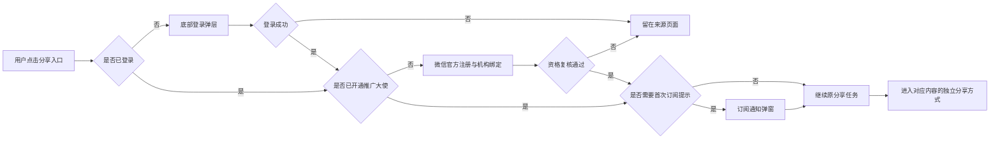
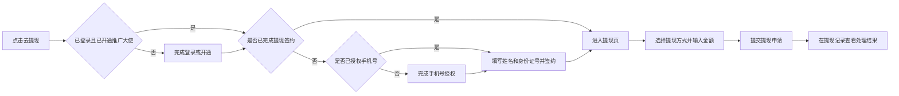

# 黛莱皙私域推客带货平台 产品总纲与 PRD


| 项目    | 内容                                                        |
| ----- | --------------------------------------------------------- |
| 文档版本  | v3.1                                                      |
| 更新日期  | 2026-07-22                                                |
| 产品形态  | 微信小程序 + Web 运营后台                                          |
| 文档状态  | 待评审                                                       |
| 小程序原型 | [打开小程序低保真交互原型](https://zhangrulei.github.io/dailaixi-promoter-platform/prototype/homepage-lowfi/) |
| 后台原型  | [打开运营后台低保真交互原型](https://zhangrulei.github.io/dailaixi-promoter-platform/prototype/admin-lowfi/)   |
| 历史版本  | [v2.12 详细历史版](./archive/黛莱皙推客带货平台_PRD_v2.12_历史版.md)       |


## 一、产品总纲


### 1. 项目背景

黛莱皙已有自有微信小店、视频号直播、短视频内容和可触达的私域人群。本项目基于微信小店优选联盟带货机构的推客带货能力，建设品牌自有推客小程序和运营后台，将商品、直播、视频及运营素材分发给私域推客，帮助推客完成分享、自购、订单与收益查询，并由机构完成后续佣金结算和提现管理。

### 2. 产品目标

建立黛莱皙商品、直播、视频和素材的统一私域分发入口，发展推客并带动可归因GMV增长。

### 3. 用户与业务状态


| 状态         | 可用能力                                 |
| ---------- | ------------------------------------ |
| 游客         | 浏览公开首页、分类、商品、直播视频、发圈、教程和帮助内容         |
| 已登录未开通推广大使 | 保留浏览能力；触发分享或收益相关能力时进入推广大使开通流程        |
| 已开通推广大使    | 分享商品、直播及发圈内容，发起自购，查看订单、收益、粉丝和邀请页面    |
| 已开通未完成提现签约 | 可正常推广和查看收益；首次提现时，未授权手机号先完成授权，再补充姓名和身份证号并签约 |
| 资格异常或已解绑   | 可查看允许保留的历史信息；暂停生成新的推广载体，并提示重新校验或联系客服 |


### 5. 术语定义


| 名称     | 定义                                    |
| ------ | ------------------------------------- |
| 推广大使   | 已完成微信侧推客注册、机构绑定且资格有效的用户侧展示名称，不代表等级    |
| 推广发起   | 成功生成或打开可用于分享的官方推广载体，不等于已实际发送          |
| 自购发起   | 用户通过本人推广身份进入购买链路，不等于已支付或已结算           |
| 我的收益   | 已提现收益、可提现收益和待结算收益的合计口径；未登录或未开通时显示“--” |
| 可提现收益  | 已完成结算并进入机构可支付余额、扣除冻结和调整后的金额           |
| 待结算收益  | 已产生但尚未完成结算、暂不可提现的佣金                   |
| 直接好友   | 通过本人邀请入口建立的一层有效邀请关系                   |
| 好友分佣   | 机构按后台生效比例，根据直接好友有效结算订单生成给邀请人的本地收益     |
| 支付 GMV | 按支付时间统计的推客归因订单金额                      |
| 有效 GMV | 支付 GMV 扣除截至更新时间已确认的取消和退款金额            |
| 结算 GMV | 达到微信结算条件并按结算时间统计的订单金额                 |


---


## 二、产品信息架构与核心流程


### 1. 小程序信息架构

```text
小程序
├─ 首页
│  ├─ Banner / 快捷频道 / 热门商品 / 商品 Feed
│  ├─ 商品详情
│  ├─ 列表分享
│  └─ 详情分享
├─ 分类
│  └─ 一级分类 / 二级分类 / 排序 / 商品 Feed
├─ 直播视频
│  ├─ 直播 Feed / 直播详情
│  └─ 视频 Feed
├─ 发圈
│  ├─ 带货发圈 Feed
│  └─ 宣发 Feed
├─ 我的
│  ├─ 个人信息与设置
│  ├─ 我的收益 / 佣金明细 / 手机号授权 / 首次提现签约 / 提现 / 提现记录
│  ├─ 我的粉丝 / 邀请好友 / 好友收到邀请
│  └─ 推客教程 / 官方客服 / 帮助中心
└─ 全局流程
   ├─ 首次登录 / 后续静默登录
   ├─ 推广大使开通
   └─ 订阅通知
```

底部导航固定为：首页、分类、直播视频、发圈、我的。

### 2. 运营后台信息架构

```text
运营后台
├─ 首页
│  └─ 经营概览
├─ 内容管理
│  ├─ 商品管理
│  ├─ 直播管理
│  ├─ 视频管理
│  ├─ 发圈与宣发素材
│  └─ 分类、搜索、教程与帮助内容
├─ 推客管理
│  └─ 推客列表（含详情、资格状态与直接粉丝）
├─ 订单管理
│  └─ 订单列表（含佣金、自购与归因信息）
├─ 财务管理
│  ├─ 用户对账单
│  ├─ 提现审核
│  └─ 财务设置
├─ 授权管理
│  └─ 授权小店列表（含已过期）
├─ 系统设置
│  ├─ 基础设置
│  ├─ 页面装修
│  ├─ 分享设置
│  └─ 协议与隐私
└─ 账户管理
   ├─ 后台账号
   └─ 操作日志
```


### 3. 分享主流程




### 4. 提现主流程




---


## 三、小程序 PRD

以下需求按页面实际组成描述：列表类需求依次说明展示字段、搜索筛选、页面操作和特殊规则；详情类需求说明展示字段、操作和状态边界；流程类需求说明前置条件、分支、成功结果和失败处理。


### 1. 全局能力

[查看完整小程序原型](https://zhangrulei.github.io/dailaixi-promoter-platform/prototype/homepage-lowfi/)

| 需求名称 | 需求描述 |
| --- | --- |
| 启动与游客浏览 | <ul><li><strong>初始化：</strong>获取页面配置、会话状态和推广大使资格；单个非核心模块失败不阻断小程序启动。</li><li><strong>游客能力：</strong>可浏览首页、分类、商品、直播视频、发圈、教程和帮助等公开内容。</li><li><strong>特殊规则：</strong>收益或身份数据未知时显示“--”，不得展示模拟收益、虚假推客 ID 或以 0.00 代替未知金额。</li></ul> |
| 首次登录 | <ul><li><strong>触发条件：</strong>游客点击分享、自购、查看收益、邀请好友等受限操作时展示登录面板，不在首次进入时强制登录。</li><li><strong>登录内容：</strong>登录前必须同意用户协议和隐私政策；头像、昵称为选填项。</li><li><strong>结果处理：</strong>成功后继续原操作；取消、失败或网络中断时留在来源页，并提供重试入口。</li></ul> |
| 静默登录 | <ul><li><strong>处理方式：</strong>已注册用户优先静默恢复会话，不重复要求用户填写资料。</li><li><strong>特殊规则：</strong>静默登录不得读取、覆盖头像和昵称；失败后保留游客浏览能力，用户再次触发受限操作时再展示登录面板。</li></ul> |
| 推广大使开通 | <ul><li><strong>触发条件：</strong>分享、自购、查看收益和邀请好友前校验登录及推广大使资格。</li><li><strong>开通流程：</strong>未开通时进入微信官方注册及机构绑定流程，返回小程序后必须由服务端重新查询资格。</li><li><strong>结果处理：</strong>资格复核通过后继续原操作；取消、失败或资格异常时留在来源页，不生成新的推广载体。</li></ul> |
| 订阅通知 | <ul><li><strong>订阅类型：</strong>收益、提现、好友和活动通知。</li><li><strong>操作：</strong>仅在用户主动触发相关业务时申请订阅，不在首次启动时集中索取。</li><li><strong>特殊规则：</strong>微信确认允许后隐藏订阅入口；拒绝、关闭或失败时保留入口，且不得阻断原操作。</li></ul> |
| 任务续接 | <ul><li><strong>保存内容：</strong>登录、开通和订阅流程需保存来源页面、业务对象和用户原操作。</li><li><strong>结果处理：</strong>成功后返回来源页并继续原操作；取消或失败时保留来源页面和已选对象，不自动跳转其他页面。</li></ul> |


### 2. 首页与商品推广

[查看完整原型：首页、商品详情、列表分享、详情分享](https://zhangrulei.github.io/dailaixi-promoter-platform/prototype/homepage-lowfi/)


| 需求名称 | 需求描述 |
| --- | --- |
| 首页结构 | <ul><li>展示 Logo、搜索框、Banner、快捷频道、热门商品和商品 Feed。</li><li>不展示直播、短视频、消息中心和业务分享入口。</li></ul> |
| Banner | <ul><li><strong>展示字段：</strong>图片、标题及轮播指示；跳转目标不在页面直接展示。</li><li><strong>操作：</strong>点击后按后台配置进入商品、直播、视频、发圈专题、教程或小程序内部页面。</li><li><strong>特殊规则：</strong>未配置跳转目标时仅展示、不可点击；无有效 Banner 时整个模块隐藏；目标失效后停止跳转。</li></ul> |
| 快捷频道 | <ul><li><strong>展示字段：</strong>频道图标和名称，按后台排序展示。</li><li><strong>操作：</strong>点击后进入后台配置的商品分类或内部页面，并带入对应筛选条件。</li><li><strong>特殊规则：</strong>仅展示已启用且跳转目标有效的频道；无有效频道时整个模块隐藏。</li></ul> |
| 热门商品 | <ul><li><strong>列表字段：</strong>商品图、标题、当前价格、预计收益、“去分享”和推荐理由。</li><li><strong>列表操作：</strong>点击商品正文进入详情；点击“去分享”进入列表分享流程。</li><li><strong>特殊规则：</strong>商品由后台选择并排序，纵向连续展示，不设置“查看更多”；商品下架、推广计划失效或后台取消推荐后停止展示。</li></ul> |
| 商品 Feed | <ul><li><strong>列表字段：</strong>商品主图、标题、当前价格和预计收益。</li><li><strong>筛选与分页：</strong>支持按全部、新品、护肤、彩妆、套装等后台有效分类切换，并支持上拉分页；切换分类时重置分页。</li><li><strong>列表操作：</strong>点击商品卡进入商品详情，不在卡片上提供分享或活动按钮。</li><li><strong>特殊规则：</strong>与分类页商品卡字段和交互保持一致；不得展示下架、推广失效或授权失效商品。</li></ul> |
| 商品详情 | <ul><li><strong>展示字段：</strong>轮播图、商品名称、店铺、SKU、价格、库存、预计收益、佣金口径提示、推广文案和商品详情。</li><li><strong>页面操作：</strong>切换 SKU、复制或重新生成推广文案、自购、分享赚。</li><li><strong>特殊规则：</strong>切换 SKU 后同步更新价格、库存和预计收益；无库存 SKU 不可选择；推广文案仅基于已审核商品资料生成。</li></ul> |
| 商品分享 | <ul><li><strong>列表分享：</strong>展示分享文案、商品图片、小程序海报、微信码和小程序分享入口。</li><li><strong>详情分享：</strong>展示商品海报、保存海报、购买链接和贴图转发入口。</li><li><strong>操作前校验：</strong>依次校验登录、推广大使资格、商品状态和推广计划；通过后为当前推客及当前商品生成推广载体。</li><li><strong>失败处理：</strong>内容失效、资格异常或生成失败时不复用其他用户或商品的旧载体，并保留重试或返回入口。</li></ul> |
| 自购 | <ul><li><strong>入口：</strong>商品详情提供“自购”和“分享赚”两个独立操作。</li><li><strong>特殊规则：</strong>自购仅表示以本人推广身份发起购买；订单归因、支付、佣金及结算结果以微信数据为准，不在点击时计入订单或收益。</li></ul> |
| 商品搜索 | <ul><li><strong>搜索范围：</strong>商品名称、运营短标题及后台配置的搜索扩展词；同时支持搜索直播和短视频，并按“全部、商品、直播、短视频”分组。</li><li><strong>结果字段：</strong>各类型结果展示对应内容卡和结果数量；关键词回显并保留最近搜索记录。</li><li><strong>结果操作：</strong>点击结果进入对应详情或微信承载页；商品卡仍按商品卡规则处理。</li><li><strong>特殊规则：</strong>仅返回当前有效、已授权且已上架内容；无结果时展示空状态和返回热门商品入口。</li></ul> |


### 3. 分类

[查看完整原型：分类](https://zhangrulei.github.io/dailaixi-promoter-platform/prototype/homepage-lowfi/)


| 需求名称 | 需求描述 |
| --- | --- |
| 分类导航 | <ul><li><strong>展示字段：</strong>一级分类名称与图标、当前一级分类下的“全部”和二级分类。</li><li><strong>操作：</strong>切换一级或二级分类后刷新商品列表，并保持导航选中态与查询条件一致。</li><li><strong>特殊规则：</strong>一、二级分类按后台排序展示；隐藏或删除的分类不再展示，深链目标失效时回到默认分类并提示“分类已调整”。</li></ul> |
| 分类商品 | <ul><li><strong>列表字段：</strong>商品主图、标题、当前价格和预计收益。</li><li><strong>列表操作：</strong>点击商品卡进入详情；不在分类商品卡展示分享或活动按钮。</li><li><strong>特殊规则：</strong>仅展示当前分类下已上架且可推广商品，支持分页；切换分类时取消或忽略上一条件的迟到结果。</li></ul> |
| 筛选与排序 | <ul><li><strong>搜索：</strong>支持按商品名称和搜索扩展词搜索当前有效商品。</li><li><strong>排序：</strong>支持后台默认排序、预计收益升降序和价格升降序。</li><li><strong>空状态：</strong>无结果时展示当前筛选条件和“查看全部商品”入口，不跨越有效分类范围拼接无关商品。</li></ul> |


### 4. 直播视频

[查看完整原型：直播 Feed、直播详情、视频 Feed](https://zhangrulei.github.io/dailaixi-promoter-platform/prototype/homepage-lowfi/)


| 需求名称 | 需求描述 |
| --- | --- |
| 页面结构 | <ul><li><strong>频道切换：</strong>通过“直播 / 视频”切换两个内容列表，切换后保留各自滚动位置和筛选条件。</li><li><strong>搜索：</strong>支持按直播标题、视频标题和视频号名称进行频道内搜索。</li><li><strong>特殊规则：</strong>仅展示当前有效、已授权且后台已上架内容；无结果时展示对应频道空状态。</li></ul> |
| 直播列表 | <ul><li><strong>列表字段：</strong>封面、直播标题、直播状态、视频号、开播时间、推荐文案、预计收益、推广人数和“去分享”。</li><li><strong>筛选：</strong>支持直播中、待开播和已结束状态筛选；默认直播中优先、其次按开播时间排序。</li><li><strong>列表操作：</strong>点击直播正文进入详情；点击“去分享”触发登录和推广资格校验。</li><li><strong>特殊规则：</strong>直播状态以微信最新数据为准；已结束、已取消或授权失效内容不可继续生成推广载体。</li></ul> |
| 直播详情 | <ul><li><strong>展示字段：</strong>封面、标题、视频号、直播状态、开播时间、分享话术和直播爆品。</li><li><strong>爆品字段：</strong>商品图片、标题、价格和预计收益。</li><li><strong>页面操作：</strong>复制分享话术、进入直播间；不可用直播展示状态原因，不提供无效跳转。</li></ul> |
| 直播分享 | <ul><li><strong>操作前校验：</strong>校验登录、推广大使资格、直播状态及合作授权。</li><li><strong>分享方式：</strong>通过视频号官方能力进入或分享直播间，不在小程序自建直播分享面板。</li><li><strong>失败处理：</strong>直播结束、取消、授权失效或微信跳转失败时展示明确提示，并保留返回直播列表入口。</li></ul> |
| 视频列表 | <ul><li><strong>列表字段：</strong>封面、播放标识、运营标题、视频号名称和时长；官方未提供或无法核验的播放量不展示。</li><li><strong>搜索筛选：</strong>支持按标题和视频号名称搜索，仅展示后台已上架视频。</li><li><strong>列表操作：</strong>点击后直接进入对应视频号视频，不设置小程序视频详情页和推广按钮。</li><li><strong>特殊规则：</strong>视频下架、删除或合作授权失效后停止展示和跳转。</li></ul> |


### 5. 发圈

[查看完整原型：带货发圈、宣发](https://zhangrulei.github.io/dailaixi-promoter-platform/prototype/homepage-lowfi/)


| 需求名称 | 需求描述 |
| --- | --- |
| 页面结构 | <ul><li><strong>频道切换：</strong>通过“带货发圈 / 宣发”切换内容列表。</li><li><strong>搜索筛选：</strong>支持按文案、素材标题和关联商品关键词搜索，并按后台有效分类筛选。</li><li><strong>特殊规则：</strong>切换频道或筛选条件时重置分页，仅展示当前已发布版本。</li></ul> |
| 带货发圈 | <ul><li><strong>列表字段：</strong>发布主体、发布时间、已审核文案、图片、关联商品、商品价格和预计收益。</li><li><strong>列表操作：</strong>复制评论、分享好物、下载素材；点击关联商品可进入商品详情。</li><li><strong>特殊规则：</strong>分享商品由后台预先绑定，前端不可重新选品；复制、下载和分享只记录用户操作意图，不认定已经发布朋友圈。</li></ul> |
| 宣发 | <ul><li><strong>列表字段：</strong>发布主体、发布时间、已审核文案及图片或视频素材。</li><li><strong>列表操作：</strong>复制文案、下载图片或视频；不展示关联商品、预计收益和商品分享入口。</li></ul> |
| 素材有效性 | <ul><li><strong>有效范围：</strong>仅使用后台当前已发布且未过期版本。</li><li><strong>失效处理：</strong>素材撤回、过期或授权失效后停止新的复制、下载和分享，并提示内容已失效。</li><li><strong>能力边界：</strong>不提供自动群发或自动发布朋友圈。</li></ul> |


### 6. 我的

[查看完整原型：我的及其全部子页面](https://zhangrulei.github.io/dailaixi-promoter-platform/prototype/homepage-lowfi/)


| 需求名称 | 需求描述 |
| --- | --- |
| 我的首页 | <ul><li>展示头像、昵称和当前身份。</li><li>展示我的收益、订阅通知、佣金明细、提现记录、我的粉丝、邀请好友、推客教程、官方客服、帮助中心和系统设置入口。</li></ul> |
| 我的收益 | <ul><li><strong>展示字段：</strong>可提现收益、累计收益、已提现收益和待结算收益，分别提供口径说明。</li><li><strong>页面操作：</strong>显示或隐藏全部金额、查看口径、从可提现收益进入提现流程。</li><li><strong>特殊规则：</strong>未登录、未开通或金额未知时显示“--”；待结算收益不可提现；提交提现申请后按资金规则更新可提现和已提现口径，不得仅因点击提交重复累计。</li></ul> |
| 订阅通知 | <ul><li><strong>展示字段：</strong>订阅提示、通知类型和当前订阅入口。</li><li><strong>页面操作：</strong>用户主动申请收益、提现、好友和活动通知。</li><li><strong>特殊规则：</strong>微信确认允许后隐藏入口；拒绝、关闭或失败时保留入口，不循环弹窗。</li></ul> |
| 佣金明细 | <ul><li><strong>列表字段：</strong>订单号、商品、来源、支付金额、预计或实际佣金、佣金状态、下单时间和更新时间。</li><li><strong>搜索筛选：</strong>支持按订单号、商品名称搜索，按待结算、已结算、已失效等佣金状态和时间范围筛选。</li><li><strong>列表操作：</strong>查看详情、复制完整订单号；用户不可编辑或删除佣金记录。</li><li><strong>特殊规则：</strong>订单号默认脱敏；佣金及状态以微信同步结果为准，退款或调整后展示最新结果和原因。</li></ul> |
| 首次提现与签约 | <ul><li><strong>前置条件：</strong>用户已登录、已开通推广大使且存在可提现收益。</li><li><strong>未签约分支：</strong>先校验手机号授权；未授权时调用小程序原生手机号授权组件，授权成功后再填写姓名和身份证号并签约。</li><li><strong>已签约分支：</strong>直接进入提现页，不重复要求手机号授权和身份签约。</li><li><strong>失败处理：</strong>授权、签约取消或失败时不进入提现提交，保留可重试状态；姓名和身份证号仅用于提现签约。</li></ul> |
| 提现申请 | <ul><li><strong>页面字段：</strong>可提现余额、提现渠道、提现金额、单笔及单日限额、税费说明和预计到账说明。</li><li><strong>页面操作：</strong>选择后台已启用渠道、输入金额并提交提现申请。</li><li><strong>校验规则：</strong>金额不得低于单笔下限、高于单笔上限、单日剩余额度或可提现余额；重复点击或重复请求只能生成一条有效申请。</li><li><strong>结果处理：</strong>提交成功后生成“待处理”记录并按财务口径冻结或扣减可提现余额；只有符合已提现口径的金额计入已提现收益，驳回或渠道退回时恢复相应余额并保留流水。</li></ul> |
| 提现记录 | <ul><li><strong>列表字段：</strong>提现单号、申请金额、处理状态、税费、实际到账金额、提现方式、申请时间和结果说明。</li><li><strong>搜索筛选：</strong>支持按提现状态和申请时间筛选。</li><li><strong>列表操作：</strong>查看提现详情；用户不可编辑或删除申请。</li><li><strong>特殊规则：</strong>处理中不展示尚未确定的税费和实际到账金额；到账、驳回或退回后展示最终金额和原因。</li></ul> |
| 我的粉丝 | <ul><li><strong>概览字段：</strong>直接邀请人数、好友分佣金额。</li><li><strong>列表字段：</strong>头像、昵称、推客 ID、手机号、资格状态、账户状态、关系建立时间和好友分佣。</li><li><strong>搜索筛选：</strong>支持按昵称、手机号和推客 ID 搜索，按资格状态筛选。</li><li><strong>列表操作：</strong>查看直接好友基本信息、进入邀请好友；不展示编辑、删除和多级关系操作。</li><li><strong>特殊规则：</strong>仅展示一层直接邀请关系；手机号默认脱敏；分佣比例为 0 时不新增分佣，历史记录保留。</li></ul> |
| 邀请好友 | <ul><li><strong>展示内容：</strong>邀请文案、已启用邀请海报和邀请规则。</li><li><strong>页面操作：</strong>分享微信好友、保存海报和贴图转发。</li><li><strong>关系规则：</strong>好友通过邀请进入注册和机构绑定流程；关系以服务端有效记录为准，已有有效关系不因再次打开其他邀请链接自动改绑。</li><li><strong>特殊规则：</strong>不提供现金邀请奖励；分享按钮只记录分享意图，不表示好友已接受。</li></ul> |
| 推客教程 | <ul><li><strong>列表字段：</strong>标题、分类、内容形式和更新时间。</li><li><strong>搜索筛选：</strong>支持按标题搜索，并按教程分类和图文或视频形式筛选。</li><li><strong>列表操作：</strong>点击进入图文或视频详情。</li><li><strong>特殊规则：</strong>仅展示后台已发布内容；不记录学习进度、完成状态和考试结果。</li></ul> |
| 客服与帮助 | <ul><li><strong>官方客服：</strong>点击后跳转后台配置的机构企业微信；不可用时展示营业说明和重试或其他联系指引。</li><li><strong>帮助中心：</strong>按主题展示问题与答案，支持关键词搜索，并提供联系客服入口。</li></ul> |
| 系统设置 | <ul><li><strong>资料字段：</strong>头像、昵称、手机号和联系方式；手机号、联系方式默认脱敏。</li><li><strong>页面操作：</strong>修改选填资料、查看用户协议和隐私政策、退出登录、申请账号注销。</li><li><strong>特殊规则：</strong>退出登录不等于注销；注销前说明待处理提现、待结算收益和依法保留财务记录的处理方式。</li></ul> |


### 7. 页面状态与降级


| 场景      | 处理方式                            |
| ------- | ------------------------------- |
| 加载中     | 使用页面级或模块级骨架，避免全屏阻塞              |
| 无数据     | 模块允许隐藏时隐藏；列表页展示明确空态和返回入口        |
| 内容失效    | 禁止继续生成新的推广载体，保留必要说明并推荐返回有效内容    |
| 登录或资格失败 | 留在来源页，说明失败原因并提供重试或客服入口          |
| 微信跳转失败  | 提示检查微信版本、网络或稍后重试，不提供绕过官方流程的替代链路 |
| 金额未知    | 使用“--”或“处理中”，不以 0.00 代替未知结果     |


---


## 四、运营后台 PRD

[查看完整运营后台原型](https://zhangrulei.github.io/dailaixi-promoter-platform/prototype/admin-lowfi/)

后台一级导航固定为：首页、内容管理、推客管理、订单管理、财务管理、授权管理、系统设置、账户管理。包含多个二级页面的一级模块在左侧导航下方展开二级菜单；只有一个页面的模块仅展示一级菜单，点击后直接进入，不显示展开符号。页面内容顶部不重复展示二级菜单。经营统计和导出能力归入对应业务模块，不再单独设置“数据中心”；后台账户统一在“账户管理”维护。

以下需求按页面实际能力描述：列表页依次说明列表字段、搜索筛选、列表操作和特殊规则；配置页说明配置字段、页面操作和生效规则。未在对应页面列出的新增、删除、导出或批量操作，均不提供。

### 后台公共规则

- 页面操作必须放在其所属的内容 Box 内，不在页面内容区外单独悬置操作按钮；列表操作放入筛选工具栏，配置操作放入对应卡片标题栏或底部。
- 导出仅保留在订单列表、用户对账单、提现审核等核心交易及财务页面，其他内容、推客、授权、系统和账户页面不提供导出。
- 后台凡用于表示推客身份的字段，包括推客、收益人、邀请人、被邀请人及财务流水用户，统一在同一信息单元内展示头像、昵称和推客 ID；手机号等其他信息按业务需要放在独立字段中。


| 需求名称 | 需求描述 |
| --- | --- |
| 查询与列表状态 | <ul><li><strong>查询：</strong>各页面仅提供本节列明的关键词、状态、类型或时间条件；多个条件组合生效，重置后恢复默认列表。</li><li><strong>分页：</strong>列表底部展示总数、页码和每页条数；切页不得重复或遗漏数据。</li><li><strong>页面状态：</strong>统一提供加载中、空结果和加载失败状态；失败时保留筛选条件并允许重试。</li><li><strong>敏感信息：</strong>手机号、证件号、银行卡等按后台统一规则脱敏。</li></ul> |
| 权限与访问 | <ul><li><strong>权限模型：</strong>由后台规定，仅配置一级菜单权限，不配置角色、二级菜单或独立操作权限。</li><li><strong>访问控制：</strong>账号只能看到和访问已授权一级模块及其子页面；通过 URL 或接口访问未授权模块时必须拒绝，且不得返回业务数据。</li><li><strong>账号状态：</strong>封禁或删除账号后，登录和已有会话均不可继续访问后台。</li></ul> |
| 发布与版本 | <ul><li><strong>适用范围：</strong>影响线上展示、分佣、提现或存量关系的内容和配置。</li><li><strong>生效规则：</strong>草稿不影响线上；发布后按生效时间应用，新版本不得直接覆盖历史版本和已生效记录。</li><li><strong>历史保护：</strong>新配置仅影响生效后的新业务，已有订单、提现申请、资金流水和协议同意记录按发生时版本保留。</li></ul> |
| 操作留痕 | <ul><li><strong>记录范围：</strong>发布、上下架、授权同步、分佣、提现审核、财务配置、账号权限和敏感数据操作。</li><li><strong>记录字段：</strong>操作对象、操作人、操作时间、变更前后内容和处理结果。</li></ul> |


### 1. 首页


| 需求名称 | 需求描述 |
| --- | --- |
| 经营概览 | <ul><li><strong>指标：</strong>推客数、订单数、支付 GMV、有效 GMV、结算 GMV、佣金、提现和退款；支付、有效和结算 GMV 分开统计。</li><li><strong>筛选：</strong>支持常用时间范围和自定义起止时间，切换后同步刷新全部指标、趋势和排行。</li><li><strong>操作：</strong>仅查看，不提供数据编辑。</li></ul> |
| 趋势与排行 | <ul><li><strong>趋势字段：</strong>日期、支付 GMV、支付订单数。</li><li><strong>排行字段：</strong>内容名称、内容类型、推广次数、支付 GMV、排名。</li><li><strong>特殊规则：</strong>趋势和排行必须与同一时间范围下的订单及推广明细汇总一致。</li></ul> |


### 2. 内容管理


| 需求名称 | 需求描述 |
| --- | --- |
| 商品管理 | <ul><li><strong>列表字段：</strong>商品（主图、名称、商品 ID）、来源店铺、商品分类、售价、预估佣金、上架状态、首页推荐、推荐文案、更新时间、操作。</li><li><strong>搜索筛选：</strong>按商品名称或商品 ID 搜索；按上架状态筛选。</li><li><strong>列表操作：</strong>同步商品、批量设置佣金、批量归类；单行支持上架/下架、推荐/取消推荐、调整佣金、编辑推荐文案和排序。</li><li><strong>特殊规则：</strong>商品由微信小店同步，不提供新增和删除；商品仅归属一个二级分类；推荐前必须已上架，下架时同步取消首页推荐；单品佣金优先于默认佣金，变更不回溯历史订单。</li></ul> |
| 直播管理 | <ul><li><strong>列表字段：</strong>直播间、直播状态、上架状态、开播时间、主推商品、分享话术、排序、操作。</li><li><strong>搜索筛选：</strong>按直播间或视频号搜索；按直播状态、上架状态筛选。</li><li><strong>列表操作：</strong>同步直播，上架/下架，配置主推商品、推荐文案、分享话术和排序，查看或编辑详情。</li><li><strong>特殊规则：</strong>直播及预告由微信同步，不提供新增和删除；直播状态以微信为准；未配置至少一条分享话术时不可上架。</li></ul> |
| 视频管理 | <ul><li><strong>列表字段：</strong>视频（封面、标题）、视频号、时长、上架状态、人工排序、最近同步时间、操作。</li><li><strong>搜索筛选：</strong>按视频标题或视频号搜索；按上架状态筛选。</li><li><strong>列表操作：</strong>同步视频，上架/下架和调整排序。</li><li><strong>特殊规则：</strong>视频由微信同步，不提供新增和删除；仅同步并展示可通过官方链路跳转的有效视频。</li></ul> |
| 发圈与宣发 | <ul><li><strong>列表字段：</strong>内容与素材、类型（带货/宣发）、绑定商品、上架状态、排序、更新时间、操作。</li><li><strong>搜索筛选：</strong>按文案、商品或素材 ID 搜索；按类型、上架状态筛选。</li><li><strong>列表操作：</strong>新增、编辑、上架/下架、删除和调整排序。</li><li><strong>特殊规则：</strong>带货内容需配置文案、评论话术、图片、分类并绑定一个商品，发布后前端不可更换商品；宣发内容不关联商品，仅提供文案复制和图片下载。</li></ul> |
| 分类与搜索 | <ul><li><strong>配置字段：</strong>一级分类名称、图标、排序、显示状态、搜索扩展词；二级分类名称、所属一级分类、排序和显示状态。</li><li><strong>搜索定位：</strong>通过一级分类树定位并查看其二级分类，不另设全文搜索。</li><li><strong>页面操作：</strong>一级分类支持新增、编辑、显隐和排序；二级分类支持新增、编辑、显隐、排序和删除；商品归类在商品管理中单笔或批量处理。</li><li><strong>特殊规则：</strong>隐藏分类时保留商品归类关系；删除二级分类时清除商品的该分类归属；扩展词仅在启用并生效后参与小程序搜索。</li></ul> |
| 教程与帮助 | <ul><li><strong>列表字段：</strong>标题或问题、类型（教程/帮助）、分类、内容形式、排序、状态、更新时间、操作。</li><li><strong>搜索筛选：</strong>按标题或问题搜索；按类型、状态筛选。</li><li><strong>列表操作：</strong>新增、编辑、发布/下架和调整排序，不提供直接删除。</li><li><strong>特殊规则：</strong>教程支持图文或视频内容；帮助内容维护问题和答案；仅已发布内容在前端可见，不记录用户学习进度或考试状态。</li></ul> |


### 3. 推客管理


| 需求名称 | 需求描述 |
| --- | --- |
| 推客列表 | <ul><li><strong>列表字段：</strong>推客（头像、昵称、推客 ID）、手机号、邀请人、资格状态、账户状态、提现签约、直接粉丝数、累计收益、可提现金额、加入时间、操作。</li><li><strong>搜索筛选：</strong>按昵称、手机号或推客 ID 搜索；按开通、注册中、资格异常、已封禁等状态筛选。</li><li><strong>列表操作：</strong>查看推客详情、查看直接粉丝、封禁或解封；不提供新增和删除。</li><li><strong>特殊规则：</strong>邀请关系只展示一层直接关系；好友收益按已结算佣金统计；本地封禁仅限制本平台业务操作，不改变微信侧推客资格，解封后重新校验微信资格。</li></ul> |


### 4. 订单管理


| 需求名称 | 需求描述 |
| --- | --- |
| 订单列表 | <ul><li><strong>列表字段：</strong>订单号、商品、推客、推广来源、支付金额、佣金信息、订单状态、自购标识、下单时间、操作。</li><li><strong>搜索筛选：</strong>按订单号、推客或商品搜索；按订单状态、自购标识和下单时间筛选。</li><li><strong>列表操作：</strong>查看详情、按当前筛选导出；订单只读，不提供新增、编辑、删除或人工归因。</li><li><strong>特殊规则：</strong>订单状态、商品、支付、自购和归因结果以微信数据为准；归因信息不足时标记“未知/待确认”，不得强行归因。</li></ul> |
| 订单导出 | <ul><li><strong>导出字段：</strong>包含当前列表展示字段及订单详情中的佣金、结算信息。</li><li><strong>范围：</strong>只导出当前筛选结果，不导出用户未获权限的数据。</li><li><strong>留痕：</strong>记录导出人、导出时间、筛选范围和文件有效期。</li></ul> |


### 5. 财务管理


| 需求名称 | 需求描述 |
| --- | --- |
| 用户对账单 | <ul><li><strong>列表字段：</strong>流水号、用户（头像、昵称、推客 ID）、业务类型、金额、余额变化、关联单号、发生时间。</li><li><strong>搜索筛选：</strong>按用户昵称、手机号或流水号搜索；按佣金到账/提现和发生时间筛选。</li><li><strong>列表操作：</strong>查看详情、按当前筛选导出；只读，不提供新增、编辑或删除。</li><li><strong>特殊规则：</strong>仅成功的资金变动写入对账单并改变余额；页面和接口均不得直接修改用户余额。</li></ul> |
| 提现审核 | <ul><li><strong>列表字段：</strong>提现单号、推客、申请金额、扣减税费、打款金额、提现渠道、处理状态、申请时间、操作。</li><li><strong>搜索筛选：</strong>按提现单号或推客搜索；按待审核、处理中、成功、驳回/退回等状态和申请时间筛选。</li><li><strong>列表操作：</strong>查看详情、单笔审核、批量通过/驳回、按当前筛选导出；只有待审核记录可选择和审核。</li><li><strong>特殊规则：</strong>驳回必须填写原因；批量审核逐条返回结果；重复审核不得重复处理资金；通过或驳回后不可撤销。通过后进入支付处理，支付成功后更新最终税费和打款金额；驳回或渠道退回时恢复应退余额并记录流水，不得重复返还。</li></ul> |
| 财务设置 | <ul><li><strong>配置字段：</strong>默认商品佣金比例、好友分佣比例、提现渠道、单笔最低金额、单笔最高金额、单日最高金额、到账说明，以及按月累计提现区间配置的税费梯度和税率。</li><li><strong>页面操作：</strong>编辑、校验并发布新配置；税费梯度支持新增、编辑和删除区间。</li><li><strong>校验规则：</strong>比例和税率须在有效范围内；最低金额不得高于单笔最高金额，单笔最高金额不得高于单日最高金额；税费区间不得重叠或遗漏边界；至少启用一个提现渠道。</li><li><strong>生效规则：</strong>单品佣金优先于默认佣金；好友分佣为 0 时不产生新好友分佣；新配置仅用于生效后的订单和提现，已提交申请及历史记录不重算。</li></ul> |
| 规则快照 | <ul><li><strong>保存时点：</strong>订单或提现申请创建时。</li><li><strong>快照内容：</strong>商品、归因、佣金、好友分佣、结算、提现限额、渠道和税费规则版本。</li><li><strong>特殊规则：</strong>后续配置变化不得改写历史订单、已提交提现申请或既有资金流水。</li></ul> |
| 财务导出 | <ul><li><strong>范围：</strong>用户对账单和提现审核分别按当前筛选结果导出。</li><li><strong>安全：</strong>导出内容按账号权限控制，敏感账户信息保持脱敏。</li><li><strong>留痕：</strong>记录导出人、筛选范围、导出时间和文件有效期。</li></ul> |


### 6. 授权管理

> 本模块仅用于从微信侧获取和查看机构已授权的小店列表，不承担授权发起、重新授权、权限配置或其他授权记录管理。


| 需求名称 | 需求描述 |
| --- | --- |
| 授权小店列表 | <ul><li><strong>列表字段：</strong>小店、小店 ID、主体名称、授权状态、授权时间、到期时间、最近同步时间、操作。</li><li><strong>搜索筛选：</strong>按小店名称、小店 ID 或主体名称搜索；按有效、已过期状态筛选。</li><li><strong>列表操作：</strong>同步和查看详情；不提供新增、编辑、删除、发起授权或重新授权。</li><li><strong>特殊规则：</strong>数据及授权状态以微信同步结果为准；过期记录保留并明确标记。</li></ul> |


### 7. 系统设置


| 需求名称 | 需求描述 |
| --- | --- |
| 基础设置 | <ul><li><strong>配置字段：</strong>企业微信客服链接、自购开关、邀请关系开关。</li><li><strong>页面操作：</strong>编辑、校验并保存；内容配置仍在内容管理维护。</li><li><strong>生效规则：</strong>客服链接和自购入口按当前有效配置展示；邀请关系开关仅影响新关系，关闭时不得删除既有关系；变更生成配置版本和操作日志。</li></ul> |
| 页面装修 | <ul><li><strong>Banner 字段：</strong>标题、图片、跳转目标（可选）、启用状态、排序。</li><li><strong>快捷频道字段：</strong>图标、名称、跳转路径、启用状态、排序。</li><li><strong>页面操作：</strong>Banner 和快捷频道均支持新增、编辑、启停、删除和上下调整排序。</li><li><strong>特殊规则：</strong>未配置跳转目标的 Banner 仅展示不可点击；小程序只展示已启用配置并按排序显示。</li></ul> |
| 分享设置 | <ul><li><strong>配置字段：</strong>邀请分享语；海报名称、图片、启用状态和排序。</li><li><strong>页面操作：</strong>编辑分享语；海报支持新增、编辑、启停、删除和排序。</li><li><strong>生效规则：</strong>用户只能查看和选择已启用海报。</li></ul> |
| 协议与隐私 | <ul><li><strong>列表字段：</strong>协议名称、当前版本、适用场景、状态、生效时间、是否要求重新确认、操作。</li><li><strong>搜索筛选：</strong>按协议名称或版本搜索；按草稿、已生效、已停用状态筛选。</li><li><strong>列表操作：</strong>查看、新建版本、编辑草稿、发布和停用。</li><li><strong>特殊规则：</strong>协议正文、版本、生效时间和重新确认策略均由后台配置；发布新版本不得覆盖历史同意记录。</li></ul> |


### 8. 账户管理

> 本模块的“账户”指运营后台登录账户；用户佣金到账与提现流水在财务管理的“用户对账单”查询。


| 需求名称 | 需求描述 |
| --- | --- |
| 后台账号 | <ul><li><strong>列表字段：</strong>账号信息（昵称、手机号）、一级菜单权限、状态、最近登录时间、操作。</li><li><strong>搜索筛选：</strong>按昵称或手机号搜索；按正常、已封禁状态筛选。</li><li><strong>列表操作：</strong>新增、编辑、封禁、解封和删除。</li><li><strong>特殊规则：</strong>每个账号至少选择一个一级菜单；不配置角色或二级菜单权限；删除后账号不可登录，但历史操作日志保留。</li></ul> |
| 操作日志 | <ul><li><strong>列表字段：</strong>时间、操作人、事件类型、操作内容、处理结果。</li><li><strong>搜索筛选：</strong>按操作人或操作内容搜索；按事件类型和时间筛选。</li><li><strong>列表操作：</strong>查看详情；只读，不提供新增、编辑、删除或导出。</li><li><strong>特殊规则：</strong>账号删除后，其历史日志仍可按原操作人标识查询。</li></ul> |


---


## 五、数据与合规要求


### 1. 最小化数据统计

仅保留能够回答以下经营问题的数据：用户是否完成登录和推广大使开通、哪类内容发起了推广、订单及佣金处于什么状态、哪些页面或接口发生关键失败。无需记录所有页面曝光、滚动、停留或组件点击；同一业务尽量使用服务端业务记录和微信回调，前端只补充必要入口和失败信息。

### 2. 隐私与敏感信息

1. 登录前明确展示用户协议和隐私政策，协议更新按规则重新确认。
2. 头像、昵称为选填；手机号、联系方式和身份证号按用途最小化采集。
3. 姓名和身份证号仅在首次提现签约场景采集，不用于商品浏览或推广门禁。
4. 敏感信息加密存储、传输，页面和后台默认脱敏，访问和导出需单独权限。
5. 账号注销需明确影响范围并执行后台清理、匿名化或依法保留流程。


### 3. 内容与分享合规

1. 商品、直播、视频、发圈和教程发布前均需确认来源、版权、肖像及功效表述。
2. 分享链路使用微信官方允许的推客能力，不承诺独立文案、截图或脱离官方链路后的订单归因。
3. 禁止自动群发、刷单、夸大收益、虚构佣金、绕过微信注册绑定或复制已撤回素材。
4. AI 仅用于生成候选推广文案，生成结果仍需遵守内容审核、素材授权和品牌表达要求。


### 4. 资金与税务边界

平台分佣下，机构是向用户展示可提现余额并发起支付的一方。具体签约主体、收入性质、代扣代缴、开票、税费计算、支付渠道和凭证要求，需由机构财务、法务及税务专业人员确认并配置；产品不得在缺少权威规则或渠道结果时自行推算税额。

---


## 六、原型使用说明

1. [小程序低保真交互原型](https://zhangrulei.github.io/dailaixi-promoter-platform/prototype/homepage-lowfi/) 左侧目录按“小程序一级页面 → 页面内模块/子页面 → 全局流程”组织。
2. 右侧交互说明仅标注关键、有歧义或跨页面的交互；常规点击、返回、滚动不重复说明。
3. 本 PRD 按页面和业务域合并需求，原型截图以完整页面为单位插入，不将同一页面拆成多个控件级截图。
4. 原型为灰阶低保真，用于确认信息层级、页面关系、状态和流程，不作为最终视觉稿。
5. [运营后台低保真交互原型](https://zhangrulei.github.io/dailaixi-promoter-platform/prototype/admin-lowfi/) 按八个一级模块组织；含多个页面的模块在左侧展开二级菜单，只有一个页面的模块仅保留一级菜单并直接进入。页面内容区不再设置二级页签，也不重复展示模块标题和说明；列表页直接进入筛选与数据区域，总条数仅在底部分页展示。列表详情、新增、编辑和常规配置统一使用居中操作弹窗，删除、封禁及状态变更使用小型确认弹窗；复杂且需连续操作的业务才进入独立页面。

---


## 七、官方资料

- [微信小店优选联盟带货机构「推客带货功能」使用指南](https://store.weixin.qq.com/chengzhang/article/wiki?docid=7129&nonce=eaecf8415ca86666&category_key=growth_center_manual_for_promoter)
- [推客带货功能 API 文档](https://developers.weixin.qq.com/doc/store/leagueheadsupplier/api/)
