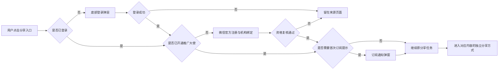
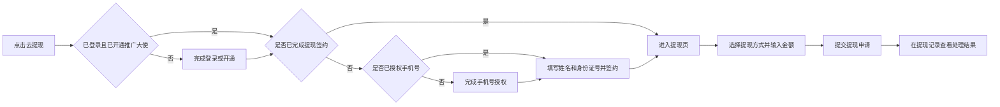

# 黛莱皙私域推客带货平台 产品总纲与 PRD


| 项目    | 内容                                                        |
| ----- | --------------------------------------------------------- |
| 文档版本  | v3.1                                                      |
| 更新日期  | 2026-07-22                                                |
| 产品形态  | 微信小程序 + Web 运营后台                                          |
| 文档状态  | 待评审                                                       |
| 小程序原型 | [打开小程序低保真交互原型](https://zhangrulei.github.io/dailaixi-promoter-platform/prototype/homepage-lowfi/) |
| 后台原型  | [打开运营后台低保真交互原型](https://zhangrulei.github.io/dailaixi-promoter-platform/prototype/admin-lowfi/)   |
| 历史版本  | [v2.12 详细历史版](./archive/黛莱皙推客带货平台_PRD_v2.12_历史版.md)       |


## 一、产品总纲


### 1. 项目背景

黛莱皙已有自有微信小店、视频号直播、短视频内容和可触达的私域人群。本项目基于微信小店优选联盟带货机构的推客带货能力，建设品牌自有推客小程序和运营后台，将商品、直播、视频及运营素材分发给私域推客，帮助推客完成分享、自购、订单与收益查询，并由机构完成后续佣金结算和提现管理。

### 2. 产品目标

建立黛莱皙商品、直播、视频和素材的统一私域分发入口，发展推客并带动可归因GMV增长。

### 3. 用户与业务状态


| 状态         | 可用能力                                 |
| ---------- | ------------------------------------ |
| 游客         | 浏览公开首页、分类、商品、直播视频、发圈、教程和帮助内容         |
| 已登录未开通推广大使 | 保留浏览能力；触发分享或收益相关能力时进入推广大使开通流程        |
| 已开通推广大使    | 分享商品、直播及发圈内容，发起自购，查看订单、收益、粉丝和邀请页面    |
| 已开通未完成提现签约 | 可正常推广和查看收益；首次提现时，未授权手机号先完成授权，再补充姓名和身份证号并签约 |
| 资格异常或已解绑   | 可查看允许保留的历史信息；暂停生成新的推广载体，并提示重新校验或联系客服 |


### 5. 术语定义


| 名称     | 定义                                    |
| ------ | ------------------------------------- |
| 推广大使   | 已完成微信侧推客注册、机构绑定且资格有效的用户侧展示名称，不代表等级    |
| 推广发起   | 成功生成或打开可用于分享的官方推广载体，不等于已实际发送          |
| 自购发起   | 用户通过本人推广身份进入购买链路，不等于已支付或已结算           |
| 我的收益   | 已提现收益、可提现收益和待结算收益的合计口径；未登录或未开通时显示“--” |
| 可提现收益  | 已完成结算并进入机构可支付余额、扣除冻结和调整后的金额           |
| 待结算收益  | 已产生但尚未完成结算、暂不可提现的佣金                   |
| 直接好友   | 通过本人邀请入口建立的一层有效邀请关系                   |
| 好友分佣   | 机构按后台生效比例，根据直接好友有效结算订单生成给邀请人的本地收益     |
| 支付 GMV | 按支付时间统计的推客归因订单金额                      |
| 有效 GMV | 支付 GMV 扣除截至更新时间已确认的取消和退款金额            |
| 结算 GMV | 达到微信结算条件并按结算时间统计的订单金额                 |


---


## 二、产品信息架构与核心流程


### 1. 小程序信息架构

```text
小程序
├─ 首页
│  ├─ Banner / 快捷频道 / 热门商品 / 商品 Feed
│  ├─ 商品详情
│  ├─ 列表分享
│  └─ 详情分享
├─ 分类
│  └─ 一级分类 / 二级分类 / 排序 / 商品 Feed
├─ 直播视频
│  ├─ 直播 Feed / 直播详情
│  └─ 视频 Feed
├─ 发圈
│  ├─ 带货发圈 Feed
│  └─ 宣发 Feed
├─ 我的
│  ├─ 个人信息与设置
│  ├─ 我的收益 / 佣金明细 / 手机号授权 / 首次提现签约 / 提现 / 提现记录
│  ├─ 我的粉丝 / 邀请好友 / 好友收到邀请
│  └─ 推客教程 / 官方客服 / 帮助中心
└─ 全局流程
   ├─ 首次登录 / 后续静默登录
   ├─ 推广大使开通
   └─ 订阅通知
```

底部导航固定为：首页、分类、直播视频、发圈、我的。

### 2. 运营后台信息架构

```text
运营后台
├─ 首页
│  └─ 经营概览
├─ 内容管理
│  ├─ 商品管理
│  ├─ 直播管理
│  ├─ 视频管理
│  ├─ 发圈与宣发素材
│  └─ 分类、搜索、教程与帮助内容
├─ 推客管理
│  └─ 推客列表（含详情、资格状态与直接粉丝）
├─ 订单管理
│  └─ 订单列表（含佣金、自购与归因信息）
├─ 财务管理
│  ├─ 用户对账单
│  ├─ 提现审核
│  └─ 财务设置
├─ 授权管理
│  └─ 授权小店列表（含已过期）
├─ 系统设置
│  ├─ 基础设置
│  ├─ 页面装修
│  ├─ 分享设置
│  └─ 协议与隐私
└─ 账户管理
   ├─ 后台账号
   └─ 操作日志
```


### 3. 分享主流程




### 4. 提现主流程




---


## 三、小程序 PRD


### 1. 全局能力

[查看完整小程序原型](https://zhangrulei.github.io/dailaixi-promoter-platform/prototype/homepage-lowfi/)

| 需求名称 | 需求描述 |
| --- | --- |
| 启动与游客浏览 | <ul><li>启动时获取页面配置、会话和用户资格。</li><li>游客可浏览公开内容。</li><li>收益未知时显示“--”，不展示模拟收益或虚假推客 ID。</li></ul> |
| 首次登录 | <ul><li>用户触发受限操作时展示登录面板。</li><li>登录前必须同意用户协议和隐私政策。</li><li>头像、昵称选填；登录成功后继续原操作。</li></ul> |
| 静默登录 | <ul><li>已注册用户优先静默恢复会话。</li><li>不得读取或覆盖头像、昵称。</li><li>失败后在用户再次触发受限操作时登录。</li></ul> |
| 推广大使开通 | <ul><li>分享、查看收益前校验推广大使资格。</li><li>未开通时进入微信官方流程。</li><li>开通成功后继续原操作。</li></ul> |
| 订阅通知 | <ul><li>支持订阅收益、提现、好友和活动通知。</li><li>拒绝、关闭或失败不得阻断原操作。</li><li>微信确认允许后隐藏订阅入口。</li></ul> |
| 任务续接 | <ul><li>登录、开通和订阅流程需保存来源页面及操作。</li><li>成功后继续原操作；取消或失败时留在来源页。</li></ul> |


### 2. 首页与商品推广

[查看完整原型：首页、商品详情、列表分享、详情分享](https://zhangrulei.github.io/dailaixi-promoter-platform/prototype/homepage-lowfi/)


| 需求名称 | 需求描述 |
| --- | --- |
| 首页结构 | <ul><li>展示 Logo、搜索框、Banner、快捷频道、热门商品和商品 Feed。</li><li>不展示直播、短视频、消息中心和业务分享入口。</li></ul> |
| Banner | <ul><li>后台可配置图片、标题、跳转目标、排序和启停状态。</li><li>未配置跳转目标时不可跳转；无有效内容时隐藏。</li></ul> |
| 快捷频道 | <ul><li>后台可配置图标、名称、排序和启停状态。</li><li>无有效内容时隐藏。</li></ul> |
| 热门商品 | <ul><li>由后台选择并排序，纵向连续展示。</li><li>展示商品图、标题、价格、预计收益、“去分享”和推荐理由。</li><li>不设置“查看更多”。</li></ul> |
| 商品 Feed | <ul><li>展示主图、标题、价格和预计收益。</li><li>与分类页商品卡保持一致，不展示活动按钮。</li></ul> |
| 商品卡操作 | <ul><li>点击卡片进入商品详情，浏览无需登录。</li><li>点击“去分享”时校验登录和推广资格，通过后进入分享页。</li></ul> |
| 商品详情 | <ul><li>展示商品轮播图、价格、预计收益、名称、店铺、佣金提示、推广文案和商品详情。</li><li>推广文案仅基于已审核商品资料生成，支持复制和重新生成。</li></ul> |
| 商品分享 | <ul><li>列表分享支持文案、图片、小程序海报、微信码和小程序分享。</li><li>详情分享支持商品海报、保存海报、购买链接和贴图转发。</li><li>分享前校验商品状态和推广资格。</li></ul> |
| 自购 | <ul><li>商品详情提供“自购”和“分享赚”两个入口。</li><li>自购订单及佣金结果以微信数据为准。</li></ul> |
| 商品搜索 | <ul><li>支持搜索商品、直播和短视频，并按类型展示结果。</li><li>无结果时展示空状态，不展示失效内容。</li></ul> |


### 3. 分类

[查看完整原型：分类](https://zhangrulei.github.io/dailaixi-promoter-platform/prototype/homepage-lowfi/)


| 需求名称 | 需求描述 |
| --- | --- |
| 分类导航 | <ul><li>支持“全部”、一级分类和二级分类切换。</li><li>一、二级分类由后台配置排序和启停状态。</li></ul> |
| 分类商品 | <ul><li>展示主图、标题、价格和预计收益。</li><li>点击进入商品详情，不展示活动按钮。</li></ul> |
| 筛选与排序 | <ul><li>支持默认排序、佣金升降序和价格升降序。</li><li>无结果时展示空状态，并提供返回全部商品入口。</li></ul> |


### 4. 直播视频

[查看完整原型：直播 Feed、直播详情、视频 Feed](https://zhangrulei.github.io/dailaixi-promoter-platform/prototype/homepage-lowfi/)


| 需求名称 | 需求描述 |
| --- | --- |
| 页面结构 | <ul><li>通过“直播 / 视频”切换两个内容列表。</li><li>支持频道内搜索，仅展示有效内容。</li></ul> |
| 直播列表 | <ul><li>展示封面、直播状态、账号、推荐文案、预计收益、推广人数和“去分享”。</li><li>点击直播卡进入直播详情。</li></ul> |
| 直播详情 | <ul><li>展示直播信息、分享话术、直播爆品和“进入直播间”。</li><li>爆品展示图片、标题、价格和预计收益。</li></ul> |
| 直播分享 | <ul><li>完成登录和推广资格校验后进入视频号直播间。</li><li>使用视频号原生分享能力，不自建分享面板。</li><li>直播不可用时展示状态提示。</li></ul> |
| 视频列表 | <ul><li>展示封面、播放标识、标题、账号和时长等基础信息。</li><li>点击后直接进入视频号视频，不设置小程序详情页和推广按钮。</li></ul> |


### 5. 发圈

[查看完整原型：带货发圈、宣发](https://zhangrulei.github.io/dailaixi-promoter-platform/prototype/homepage-lowfi/)


| 需求名称 | 需求描述 |
| --- | --- |
| 页面结构 | <ul><li>通过“带货发圈 / 宣发”切换内容。</li><li>支持关键词搜索和分类筛选。</li></ul> |
| 带货发圈 | <ul><li>展示发布主体、时间、已审核文案、图片、关联商品和预计收益。</li><li>支持复制评论、分享好物和下载素材。</li><li>分享商品由后台预先绑定，不允许重新选品。</li></ul> |
| 宣发 | <ul><li>展示已审核文案和图片或视频素材。</li><li>支持复制文案和下载素材，不提供商品分享。</li></ul> |
| 素材有效性 | <ul><li>仅使用后台当前发布版本。</li><li>素材撤回、过期或授权失效后停止复制、下载和分享。</li><li>不提供自动群发。</li></ul> |


### 6. 我的

[查看完整原型：我的及其全部子页面](https://zhangrulei.github.io/dailaixi-promoter-platform/prototype/homepage-lowfi/)


| 需求名称 | 需求描述 |
| --- | --- |
| 我的首页 | <ul><li>展示头像、昵称和当前身份。</li><li>展示我的收益、订阅通知、佣金明细、提现记录、我的粉丝、邀请好友、推客教程、官方客服、帮助中心和系统设置入口。</li></ul> |
| 我的收益 | <ul><li>展示可提现、累计、已提现和待结算收益。</li><li>支持隐藏金额和查看口径说明。</li><li>未登录或未开通时显示“--”；待结算收益不可提现。</li></ul> |
| 订阅通知 | <ul><li>支持订阅收益、提现、好友和活动通知。</li><li>微信确认允许后隐藏入口；拒绝、关闭或失败时保留。</li></ul> |
| 佣金明细 | <ul><li>支持按佣金状态和时间筛选。</li><li>展示订单、商品、来源、支付金额、佣金金额和状态。</li><li>订单号默认脱敏，支持复制完整值。</li></ul> |
| 首次提现与签约 | <ul><li>未签约用户发起提现时先校验手机号授权。</li><li>未授权时先完成手机号授权，再填写姓名和身份证号并签约。</li><li>已签约用户直接进入提现页。</li></ul> |
| 提现记录 | <ul><li>支持按状态筛选提现申请。</li><li>展示申请金额、处理状态、税费、实际到账、提现方式和结果说明。</li><li>处理中不展示尚未确定的税费和到账金额。</li></ul> |
| 我的粉丝 | <ul><li>展示直接邀请人数、好友分佣及直接好友列表。</li><li>仅支持一层邀请关系。</li><li>分佣比例为 0 时不新增分佣，历史记录保留。</li></ul> |
| 邀请好友 | <ul><li>提供邀请海报、邀请文案、分享好友、保存海报和贴图转发。</li><li>好友通过邀请进入注册和机构绑定流程。</li><li>邀请关系以服务端记录为准，不提供现金邀请奖励。</li></ul> |
| 推客教程 | <ul><li>提供分类筛选、图文或视频课程列表及详情。</li><li>不记录学习进度、完成状态和考试结果。</li></ul> |
| 客服与帮助 | <ul><li>官方客服跳转机构企业微信。</li><li>帮助中心按主题展示问题和答案，并提供联系客服入口。</li></ul> |
| 系统设置 | <ul><li>展示并支持修改头像、昵称、手机号和联系方式。</li><li>提供隐私协议、退出登录和账号注销入口。</li><li>手机号和联系方式默认脱敏。</li></ul> |


### 7. 页面状态与降级


| 场景      | 处理方式                            |
| ------- | ------------------------------- |
| 加载中     | 使用页面级或模块级骨架，避免全屏阻塞              |
| 无数据     | 模块允许隐藏时隐藏；列表页展示明确空态和返回入口        |
| 内容失效    | 禁止继续生成新的推广载体，保留必要说明并推荐返回有效内容    |
| 登录或资格失败 | 留在来源页，说明失败原因并提供重试或客服入口          |
| 微信跳转失败  | 提示检查微信版本、网络或稍后重试，不提供绕过官方流程的替代链路 |
| 金额未知    | 使用“--”或“处理中”，不以 0.00 代替未知结果     |


---


## 四、运营后台 PRD

[查看完整运营后台原型](https://zhangrulei.github.io/dailaixi-promoter-platform/prototype/admin-lowfi/)

后台一级导航固定为：首页、内容管理、推客管理、订单管理、财务管理、授权管理、系统设置、账户管理。包含多个二级页面的一级模块在左侧导航下方展开二级菜单；只有一个页面的模块仅展示一级菜单，点击后直接进入，不显示展开符号。页面内容顶部不重复展示二级菜单。经营统计和导出能力归入对应业务模块，不再单独设置“数据中心”；后台账户统一在“账户管理”维护。

### 后台公共规则

- 页面操作必须放在其所属的内容 Box 内，不在页面内容区外单独悬置操作按钮；列表操作放入筛选工具栏，配置操作放入对应卡片标题栏或底部。
- 导出仅保留在订单列表、用户对账单、提现审核等核心交易及财务页面，其他内容、推客、授权、系统和账户页面不提供导出。
- 后台凡用于表示推客身份的字段，包括推客、收益人、邀请人、被邀请人及财务流水用户，统一在同一信息单元内展示头像、昵称和推客 ID；手机号等其他信息按业务需要放在独立字段中。


| 需求名称 | 需求描述 |
| --- | --- |
| 列表与详情 | <ul><li>列表按业务需要提供关键词、状态、时间筛选和分页。</li><li>详情、导出和批量操作仅在对应模块提供。</li><li>敏感字段默认脱敏。</li></ul> |
| 发布与版本 | <ul><li>影响线上内容或资金结果的配置需保留草稿、发布时间、生效时间和历史版本。</li><li>已生效记录不得直接覆盖。</li></ul> |
| 操作留痕 | <ul><li>记录发布、授权、分佣、财务、账号和敏感数据操作。</li><li>记录操作对象、操作人、时间、变更内容和结果。</li></ul> |


### 1. 首页


| 需求名称 | 需求描述 |
| --- | --- |
| 经营概览 | <ul><li>展示推客、订单、GMV、佣金、提现和退款指标。</li><li>支持常用及自定义时间范围。</li><li>支付、有效和结算 GMV 分开统计。</li></ul> |
| 趋势与排行 | <ul><li>展示支付 GMV 和订单趋势。</li><li>展示内容推广次数和支付 GMV 排行。</li></ul> |


### 2. 内容管理


| 需求名称 | 需求描述 |
| --- | --- |
| 商品管理 | <ul><li>同步小店商品，支持筛选、分类、佣金、上下架、首页推荐和推广素材配置。</li><li>商品仅归属一个二级分类；单品佣金优先于全局佣金。</li><li>配置变更不回溯历史订单。</li></ul> |
| 直播管理 | <ul><li>同步直播和预告，支持上下架、排序、推荐文案、分享话术和主推商品配置。</li><li>直播状态以微信为准，不在后台新建直播。</li><li>上架前至少配置一条分享话术。</li></ul> |
| 视频管理 | <ul><li>同步可跳转的视频号内容，支持上下架和排序。</li><li>内容及有效状态以微信为准，不在后台新建视频。</li></ul> |
| 带货发圈 | <ul><li>管理带货文案、评论话术、图片、分类、上下架和排序。</li><li>必须绑定商品，前端不可更换分享商品。</li></ul> |
| 宣发素材 | <ul><li>管理宣发文案、图片、分类、上下架和排序。</li><li>不关联商品，仅供前端复制和下载。</li></ul> |
| 分类与搜索 | <ul><li>管理两级商品分类和搜索扩展词。</li><li>支持增改、显隐、排序和商品批量归类。</li><li>隐藏分类时保留商品归类关系。</li></ul> |
| 教程与帮助 | <ul><li>管理图文或视频教程和帮助中心问题。</li><li>支持新增、修改、发布、下架和排序。</li><li>下架后前端不可见。</li></ul> |


### 3. 推客管理


| 需求名称 | 需求描述 |
| --- | --- |
| 推客列表 | <ul><li>支持查询推客并查看身份、资格、邀请关系和收益摘要。</li><li>支持查看详情、直接粉丝及封禁或解封。</li><li>仅展示一层直接关系；本地封禁不改变微信侧资格。</li></ul> |


### 4. 订单管理


| 需求名称 | 需求描述 |
| --- | --- |
| 订单列表 | <ul><li>同步并查询微信归因订单。</li><li>展示商品、推客、来源、支付、佣金、结算和自购信息。</li><li>订单与归因结果以微信数据为准。</li></ul> |
| 订单导出 | <ul><li>按当前筛选导出订单和佣金数据。</li><li>记录导出人、时间、范围和文件有效期。</li></ul> |


### 5. 财务管理


| 需求名称 | 需求描述 |
| --- | --- |
| 用户对账单 | <ul><li>查询佣金到账和提现流水。</li><li>展示金额、余额变化及关联业务。</li><li>仅记录成功的资金变动，不允许直接修改余额。</li></ul> |
| 提现审核 | <ul><li>查询提现申请，支持单笔或批量通过、驳回。</li><li>展示用户、金额、税费、渠道和状态。</li><li>驳回必须填写原因；审核结果不可撤销。</li></ul> |
| 财务设置 | <ul><li>配置默认佣金、好友分佣、提现渠道、限额、税费梯度和到账说明。</li><li>单品佣金优先于默认佣金。</li><li>配置变更不重算历史记录。</li></ul> |
| 规则快照 | <ul><li>订单发生时保存佣金、商品、归因和结算规则版本。</li><li>后续配置变化不得改写历史订单。</li></ul> |
| 财务导出 | <ul><li>导出用户对账单和提现审核数据。</li><li>记录导出人、筛选范围和文件有效期。</li></ul> |


### 6. 授权管理

> 本模块仅用于从微信侧获取和查看机构已授权的小店列表，不承担授权发起、重新授权、权限配置或其他授权记录管理。


| 需求名称 | 需求描述 |
| --- | --- |
| 授权小店列表 | <ul><li>同步并查询机构已授权小店。</li><li>展示授权主体、状态和有效期。</li><li>列表只读；过期记录保留并标记。</li></ul> |


### 7. 系统设置


| 需求名称 | 需求描述 |
| --- | --- |
| 基础设置 | <ul><li>配置企业微信客服链接、自购开关和邀请关系开关。</li><li>内容配置统一在内容管理维护。</li></ul> |
| 页面装修 | <ul><li>管理首页 Banner 和快捷频道。</li><li>支持新增、编辑、启停、删除和排序。</li><li>Banner 跳转目标可选；快捷频道配置图标和名称。</li></ul> |
| 分享设置 | <ul><li>配置邀请分享语和分享海报。</li><li>支持海报新增、修改、启停、删除和排序。</li><li>用户只能选择已启用海报。</li></ul> |
| 推客业务参数 | <ul><li>配置推客注册、机构绑定、自购和邀请关系规则。</li><li>影响资金或存量关系的变更必须留痕。</li></ul> |
| 协议与隐私 | <ul><li>管理协议正文、版本、生效时间和重新确认策略。</li><li>历史同意记录不得覆盖。</li></ul> |


### 8. 账户管理

> 本模块的“账户”指运营后台登录账户；用户佣金到账与提现流水在财务管理的“用户对账单”查询。


| 需求名称 | 需求描述 |
| --- | --- |
| 后台账号 | <ul><li>支持新增、编辑、封禁、解封和删除后台账号。</li><li>仅配置一级菜单权限，每个账号至少拥有一个一级菜单。</li><li>删除账号后保留历史日志。</li></ul> |
| 操作日志 | <ul><li>记录账号、权限、状态和登录操作。</li><li>支持按操作人、时间和事件筛选。</li><li>不提供导出。</li></ul> |


---


## 五、数据与合规要求


### 1. 最小化数据统计

仅保留能够回答以下经营问题的数据：用户是否完成登录和推广大使开通、哪类内容发起了推广、订单及佣金处于什么状态、哪些页面或接口发生关键失败。无需记录所有页面曝光、滚动、停留或组件点击；同一业务尽量使用服务端业务记录和微信回调，前端只补充必要入口和失败信息。

### 2. 隐私与敏感信息

1. 登录前明确展示用户协议和隐私政策，协议更新按规则重新确认。
2. 头像、昵称为选填；手机号、联系方式和身份证号按用途最小化采集。
3. 姓名和身份证号仅在首次提现签约场景采集，不用于商品浏览或推广门禁。
4. 敏感信息加密存储、传输，页面和后台默认脱敏，访问和导出需单独权限。
5. 账号注销需明确影响范围并执行后台清理、匿名化或依法保留流程。


### 3. 内容与分享合规

1. 商品、直播、视频、发圈和教程发布前均需确认来源、版权、肖像及功效表述。
2. 分享链路使用微信官方允许的推客能力，不承诺独立文案、截图或脱离官方链路后的订单归因。
3. 禁止自动群发、刷单、夸大收益、虚构佣金、绕过微信注册绑定或复制已撤回素材。
4. AI 仅用于生成候选推广文案，生成结果仍需遵守内容审核、素材授权和品牌表达要求。


### 4. 资金与税务边界

平台分佣下，机构是向用户展示可提现余额并发起支付的一方。具体签约主体、收入性质、代扣代缴、开票、税费计算、支付渠道和凭证要求，需由机构财务、法务及税务专业人员确认并配置；产品不得在缺少权威规则或渠道结果时自行推算税额。

---


## 六、原型使用说明

1. [小程序低保真交互原型](https://zhangrulei.github.io/dailaixi-promoter-platform/prototype/homepage-lowfi/) 左侧目录按“小程序一级页面 → 页面内模块/子页面 → 全局流程”组织。
2. 右侧交互说明仅标注关键、有歧义或跨页面的交互；常规点击、返回、滚动不重复说明。
3. 本 PRD 按页面和业务域合并需求，原型截图以完整页面为单位插入，不将同一页面拆成多个控件级截图。
4. 原型为灰阶低保真，用于确认信息层级、页面关系、状态和流程，不作为最终视觉稿。
5. [运营后台低保真交互原型](https://zhangrulei.github.io/dailaixi-promoter-platform/prototype/admin-lowfi/) 按八个一级模块组织；含多个页面的模块在左侧展开二级菜单，只有一个页面的模块仅保留一级菜单并直接进入。页面内容区不再设置二级页签，也不重复展示模块标题和说明；列表页直接进入筛选与数据区域，总条数仅在底部分页展示。列表详情、新增、编辑和常规配置统一使用居中操作弹窗，删除、封禁及状态变更使用小型确认弹窗；复杂且需连续操作的业务才进入独立页面。

---


## 七、官方资料

- [微信小店优选联盟带货机构「推客带货功能」使用指南](https://store.weixin.qq.com/chengzhang/article/wiki?docid=7129&nonce=eaecf8415ca86666&category_key=growth_center_manual_for_promoter)
- [推客带货功能 API 文档](https://developers.weixin.qq.com/doc/store/leagueheadsupplier/api/)
